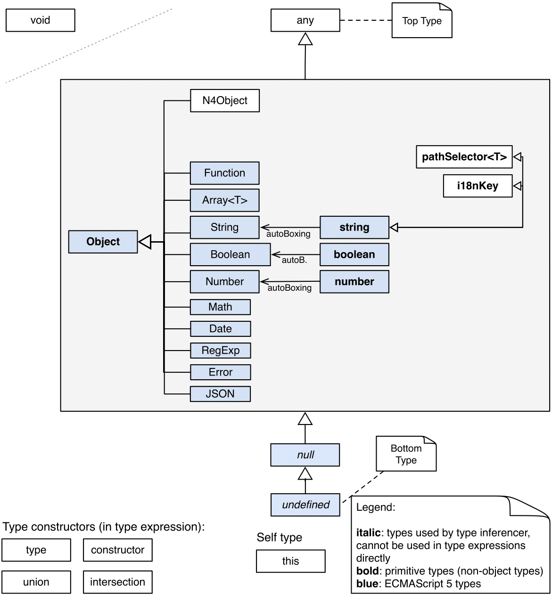
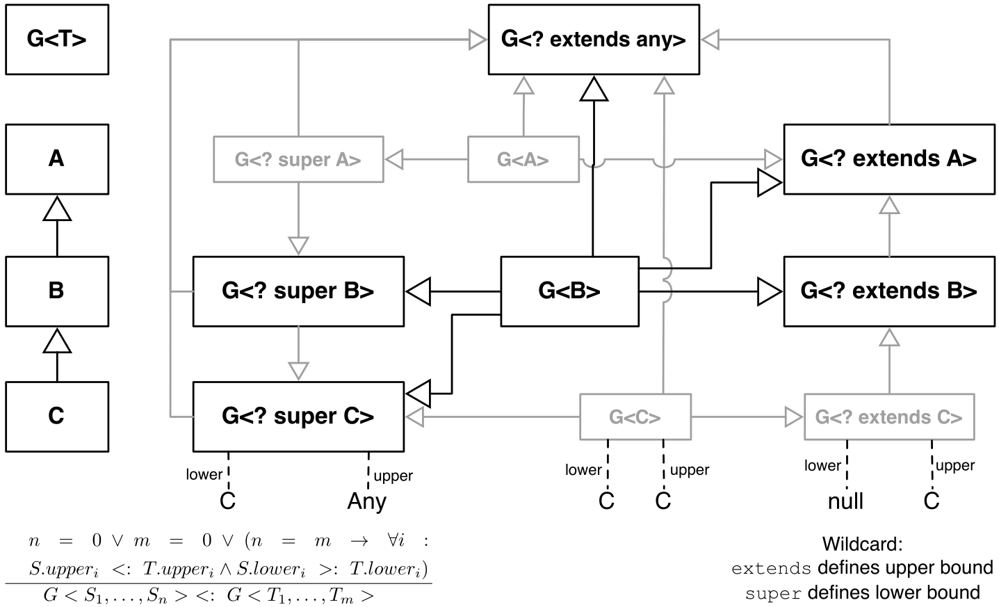
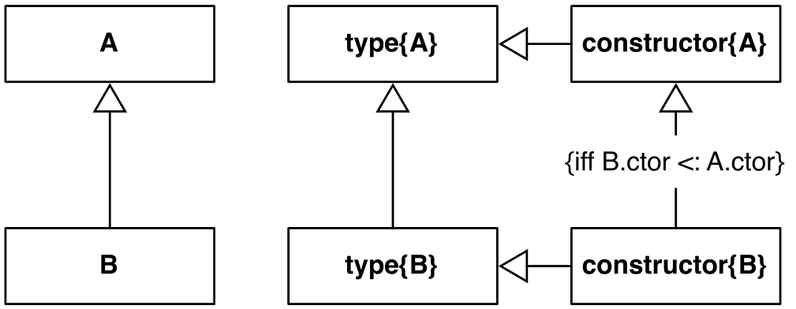

= Types
////
Copyright (c) 2016 NumberFour AG.
All rights reserved. This program and the accompanying materials
are made available under the terms of the Eclipse Public License v1.0
which accompanies this distribution, and is available at
http://www.eclipse.org/legal/epl-v10.html

Contributors:
  NumberFour AG - Initial API and implementation
////

== Overview

N4JS is essentially ECMAScript with the inclusion of
types. In the following sections we will describe how types are defined
and used in N4JS.

Besides standard JavaScript types, the following metatypes are
introduced:

* Classifiers, that is class or interface (see )
* Enum

Classifiers, methods and functions may be declared generic.

Types are related to each other by the subtype relation.

.Subtype Relation
[def]
--
We use math:[subtype$]
for the general subtype relation or type conformance. In nominal typing,
math:[\[T\subtype S\]] means that math:[$S$] is a (transitive)
supertype of math:[$T$]. Generally in structural typing, this means
that math:[$T$] conforms to math:[$S$]. math:[$\subtype$]
is defined transitive reflexive by default. We write math:[$<$] to
refer to the transitive non-reflexive relation, that is
math:[\[T < S \iff T \subtype S \land T \neq S\]]
--

Whether nominal or structural typing is used depends on the declaration
of the type or the reference. This is explained further in .

For convenience reasons, we sometimes revert the operator, that is
math:[\[T \subtype S \iff S :> T\]] We write
math:[$T \notsubtype S$] if math:[$T$] is not type conforming
to math:[$S$]. (cf. cite:[Gosling12a(S4.10)])

Join and meet are defined as follows:

.Join and Meet
[def]
--
A type math:[$J$] is called a _join_ (or least common supertype, ) of a pair of types math:[$S$]
and math:[$T$], written math:[$S \join T = J$], if +
math:[\[\begin{aligned}
& S \subtype J\\
& T \subtype J\\
& \forall L: (S\subtype L) \land (T\subtype L) \to J\subtype L\end{aligned}\]]
Similarly, we say that a type math:[$M$] is a _meet_ (or greatest
common subtype, ) of math:[$S$] and math:[$T$], written
math:[$S \meet T = M$], if +
math:[\[\begin{aligned}
& M \subtype  S\\
& M \subtype  T\\
& \forall L: (L\subtype S) \land (L\subtype T) \to L\subtype M\end{aligned}\]]
--

Note that this declarative definition needs to be specified in detail
for special cases, such as union and intersection types. Usually, the
union type of two types is also the join.

<<fig-cd-predefined-type-hierarchy,The Predefined Types Heirarchy figure>> summarizes all predefined types,
that is primitive and built-in ECMAScript and N4JS types.
Specific rules for the subtype relation are defined in the following sections.
This type hierarchy shows `any` and `undefined` as the top and bottom type (cf. cite:[Pierce02a(15.4)]) We define these types here explicitly:

.Top and Bottom Type
[def]
--
We call math:[$Top$]
the top type, if for all types math:[$T$] the relation
math:[$T \subtype  Top$] is true. We call math:[$Bot$] the
bottom type, if for all types math:[$T$] the relation
math:[$Bot<:T$] is true. In N4JS, math:[$Top=`any}$], the
bottom type math:[$Bot=`undefined}$].
--

`null` is almost similar to math:[$Bot$], except that it is not a subtype
of `undefined`.[[fig-cd-predefined-type-hierarchy]]

For every primitive type there is a corresponding built-in type as
defined in cite:[ECMA11a], e.g. and . There is no inheritance supported for
primitive types and built-in types – these types are final.

Although the diagram shows inheritance between `void` and `undefined`, this relationship is only semantic: `void` is a refinement of `undefined` from a type system viewpoint. The
same applies to the relation of `Object` as well as the subtypes shown for `String` and `String`.

[[ex:class-hierarchy]]
.Type Examples, Class Hierarchy
[example]
--

In the following examples, we assume the following classes to be given:

[source]
----
// C <: B <: A
class A{}
class B extends A{}
class C extends B{}

// independent types X, Y, and Z
class X{} class Y{} class Z{}

// interfaces I, I1 <: I, I2 <: I, I3
interface I
interface I1 extends I {}
interface I2 extends I {}
interface I3 {}

// class implementing the interfaces
class H1 implements I1{}
class H12 implements I1,I2{}
class H23 implements I2,I3{}

// a generic class with getter (contra-variance) and setter (co-variance)
class G<T> {
    get(). T;
    set(x: T): void;
}
----

--

== Type Expressions

In contrast to ECMAScript, N4JS defines static
types. Aside from simple type references, type expressions may be used
to specify the type of variables.

=== Syntax

The listing <<EBNFTypeExpression,EBNF Type Expression>> summarizes the type expression grammar.
Depending on the context, not all constructs are allowed. For example, the variadic modifier is only allowed for function parameters.

References to user-declared types are expressed via `ParameterizedTypeRef`.
This is also true for non-generic types, as the type arguments are optional.
See <<_parameterized-types,Parameterized Types>> for details on that reference.

For qualified names and type reference names, see <<_qualified-names,Qualified Names>>

The type expressions are usually added to parameter, field, or variable
declarations as a suffix, separated with colon (’:’). The same is true
for function, method, getter or setter return types. Exceptions in the
cases of object literals or destructuring are explained later on.

.Type_Annotation_Syntax
[example]
--

The following two listings show the very same code and type annotations are provided on
the left hand side. For simplicity, is always used as type expression.
footnote:[In the N4JS IDE, type annotations are highlighted differently than ordinary code.]

[source]
----
var x: string;
var s: string = "Hello";
function f(p: string): string {
    return p;
}
class C {
    f: string;
    s: string = "Hello";
    m(p: string): string {
        return p;
    }
    get x(): string {
        return this.f;
    }
    set x(v: string) {
        this.f = v;
    }
}
----

[source]
----
var x;
var s = "Hello";
function f(p) {
    return p;
}
class C {
    f;
    s = "Hello";
    m(p) {
        return p;
    }
    get x() {
        return this.f;
    }
    set x(v) {
        this.f = v;
    }
}
----

The code on the right hand side is almost all valid ECMAScript 2015,
with the exception of field declarations in the class. These are moved
into the constructor by the N4JS transpiler.

--

=== Properties

Besides the properties indirectly defined by the grammar, the following
pseudo properties are used for type expressions: Properties of :

If true, variable of that type is variadic. This is only allowed for
parameters. Default value: math:[$false$].

If true, variable of that type is optional. This is only allowed for
parameters and return types. This actually means that the type
math:[$T$] actually is a union type of . Default value:
math:[$false$].

math:[$optvar=var \lor opt$], reflect the facts that a variadic
parameter is also optional (as its cardinality is math:[$[0..n]).$]

Pseudo property referencing the variable declaration (or expression)
which `owns` the type expression.

=== Semantics

The ECMAScript types _undefined_ and _null_ are also supported. These
types cannot be referenced directly, however. Note that `void` and _undefined_
are almost similar. Actually, the inferred type of a types element with
declared type of `void` will be __undefined__. The difference between void and
undefined is that an element of type void can never have another type,
while an element of type undefined may be assigned a value later on and
thus become a different type. `void` is only used for function and method return types.

Note that not any type reference is allowed in any context. Variables or
formal parameters must not be declared `void` or union types must not be
declared dynamic, for example. These constraints are explained in the
following section.

The types mentioned above are described in detail in the next sections.
They are hierarchically defined and the following list displays all
possible types. Note that all types are actually references to types. A
type variable can only be used in some cases, e.g., the variable has to
be visible in the given scope.

[discrete]
==== ECMAScript Types

Predefined Type::
  Predefined types, such as String, Number, or Object; and .
Array Type::
  <<_array-object-type,Array Object Type>>.
Function Type::
  Described in <<_functions,Functions>>, <<_function-type,Function Type>>.
Any Type::
  <<_any-type,Any Type>>.

[discrete]
==== N4Types

Declared Type::
  (Unparameterized) Reference to defined class <<Classes>> or enum <<Enums>>.
Parameterized Type::
  Parameterized reference to defined generic class or interface; <<_parameterized-types,Parameterized Types>>.
This Type::
<<_this-type,This Type>>.
Constructor and Type Type::
  Class type, that is the meta class of a defined class or interface, <<_constructor-and-classifier-type,Constructor and Classifier Type>>.

Union Types::
Union of types, <<_union-type,Union Type>>.
Type Variable::
Type variable, <<_type-variables,Type Variables>>.

Type expressions are used to explicitly declare the type of a variable,
parameter and return type of a function or method, fields (and object
literal properties).

== Type Inference

If no type is explicitly declared, it is inferred based on the given
context, as in the expected type of expressions or function parameters,
for example. The type inference rules are described in the remainder of
this specification.

.Default Type
[def]
--
In N4JS mode , if no type is explicitly
specified and if no type information can be inferred, `any` is assumed as the default type.

In JS mode, the default type is `any+`.

Once the type of a variable is either declared or inferred, it is not
supposed to be changed.

--

[Variable type is not changeable] Given the following example.

[source]
----
var x: any;
x = 42;
x-5; // error: any is not a subtype of number.
----

Type of `x` is declared as `any` in line 1. Although a number is assigned to `x` in line 2, the type of `x` is not changed. Thus an error is issued in line 3 because the type of `x` is still `any`.

//TODO: the following should be in a 'TODO' block
At the moment, N4JS does not support type guards or, more general, effect system (cf. cite:[Nielson99a]).

== Generic and Parameterized Types

Some notes on terminology:

Type Parameter vs. Type Argument::
A type parameter is a declaration containing type variables. A type
argument is a binding of a type parameter to a concrete type or to
another type parameter. Binding to another type parameter can further
restrict the bounds of the type parameter.

This is similar to function declarations (with formal parameters) and
function calls (with arguments).

=== Generic Types

A class declaration or interface declaration with type parameters
declares a generic type. A generic type declares a family of types. The
type parameters have to be bound with type arguments when referencing a
generic type.

=== Type Variables

A type variable is an identifier used as a type in the context of a
generic class definition, generic interface definition or generic method
definition. A type variable is declared in a type parameter as follows.

[discrete]
==== Syntax

[source]
----
TypeVariable:
    name=IDENTIFIER
        ('extends' declaredUpperBounds+=ParameterizedTypeRef
            ('&' declaredUpperBounds+=ParameterizedTypeRef)*
        )?
;
----

.Type Variable as Upper Bound
[example]
--
Note that type variables are also interpreted as types. Thus, the upper bound
of a type variable may be a type variable as shown in the following
snippet:

[source]
----
class G<T> {
    <X extends T> foo(x: X): void { }
}
----
--

==== Properties [[type-variables-properties]]

A type parameter defines a type variable, which type may be constrained
with an upper bound.

Properties of `TypeVariable`:

Type variable, as type variable contains only an identifier, we use type
parameter instead of type variable (and vice versa) if the correct
element is clear from the context.

Upper bounds of concrete type bound to the type variable, i.e. a super
class.

==== Semantics [[type-variables-semantics]]

.Type Variable Semantics
[req,id=IDE-10,version=1]
--
1.  Enum is not a valid metatype in math:[$declaredUpperBounds$].
2.  Wildcards are not valid in math:[$declaredUpperBounds$].
3.  Primitives are not valid in math:[$declaredUpperBounds$].
4.  Type variables are valid in math:[$declaredUpperBounds$]. task:IDEBUG-830[]
--

A type variable can be used in any type expression contained in the
generic class, generic interface, or generic function / method
definition.

.F bounded quantification
[example]
--

Using a type variable in the upper bound reference may lead to recursive definition.

[source]
----
class Chain<C extends Chain<C, T>, T> {
    next() : C { return null; }
    m() : T { return null; }
}
----
--

==== Type Inference [[type-variables-type-inference]]

In many cases, type variables are not directly used in subtype relations
as they are substituted with the concrete types specified by some type
arguments. In these cases, the ordinary subtype rules apply without
change. However, there are other cases in which type variables cannot be
substituted:

1.  Inside a generic declaration.
2.  If the generic type is used as raw type.
3.  If a generic function / method is called without type arguments and
without the possibility to infer the type from the context.

In these cases, an unbound type variable may appear on one or both sides
of a subtype relation and we require subtype rules that take type
variables into account.

It is important to note that while type variables may have a declared
upper bound, they cannot be simply replaced with that upper bound and
treated like existential types. The following example illustrates this:

.Type variables vs. existential types
[example]
--

[source]
----
class A {}
class B extends A {}
class C extends B {}

class G<T> {}

class X<T extends A, S extends B> {

    m(): void {

        // plain type variables:
        var t: T;
        var s: S;

        t = s;  // ERROR: "S is not a subtype of T." at "s"

        // existential types:
        var ga: G<? extends A>;
        var gb: G<? extends B>;

        ga = gb;  // ok!
    }
}
----

--

Even though the upper bound of `S` is a subtype of `T`’s upper bound (since
math:[$B <: A$]), we cannot infer that `S` is a subtype of `T` (line 15),
because there are valid concrete bindings for which this would not be
true: for example, if `T` were bound to `C` and `S` to `B`.

This differs from existential types (see `ga` and `gb` and line 21): `G<? extends B>` $<:$ `G<? extends A>` ).

We thus have to define subtype rules for type variables, taking the
declared upper bound into account. If we have a subtype relation in
which a type variable appears on one or both sides, we distinguish the
following cases:

1.  If we have type variables on both sides: the result is true if and
only if there is the identical type variable on both sides.
2.  If we have a type variable on the left side and no type variable on
the right side: the result is true if and only if the type variable on
the left has one or more declared upper bounds.
math:[\[intersection(left.declaredUpperBounds) <: right\]] +
This is the case for
math:[\[`(T extends B)} <: `A}\]] in which T is an
unbound type variable and A, B two classes with math:[$B <: A$].
3.  In all other cases the result is false. +
This includes cases such as +
math:[\[`B} <: `(T extends A)}\]] which is always
false, even if math:[$B <: A$] or +
math:[\[`(T extends A)} <: `(S extends B)}\]] which
is always false, even if math:[$A = B$].

We thus obtain the following defintion:

.Subtype Relation for Type Variables
[def]
--
For two types math:[$T, S$] of which at least one is a type variable, we define

* if both math:[$T$] and math:[$S$] are type variables:
math:[\[\infer{T <: S}{T = S}\]]
* if math:[$T$] is a type variable and math:[$S$] is not:
math:[\[\infer{T <: S}{
        {T.\mathit{declaredUpperBounds}.\mathit{size} > 0} {\ \land\ \forall t \in T.\mathit{declaredUpperBounds}: t <: S}}\]]

--

=== Parameterized Types

References to generic types (cf. <<Classes>>) can be parameterized with type
arguments. A type reference with type arguments is called parameterized
type.

==== Syntax [[parameterized-types-syntax]]

[source]
----
ParameterizedTypeRef:
    ParameterizedTypeRefNominal | ParameterizedTypeRefStructural;

ParameterizedTypeRefNominal:
    declaredType=[Type|TypeReferenceName]
    (=> '<' typeArgs+=TypeArgument (',' typeArgs+=TypeArgument)* '>')?;

ParameterizedTypeRefStructural:
    definedTypingStrategy=TypingStrategyUseSiteOperator
    declaredType=[Type|TypeReferenceName]
    (=>'<' typeArgs+=TypeArgument (',' typeArgs+=TypeArgument)* '>')?
    ('with' TStructMemberList)?;

TypeArgument returns TypeArgument:
    Wildcard | TypeRef;

Wildcard returns Wildcard:
    '?'
    (
          'extends' declaredUpperBound=TypeRef
        | 'super' declaredLowerBound=TypeRef
    )?
;
----

==== Properties [[parameterized-types-properties]]

Properties of parameterized type references (nominal or structural):

`declaredType` ::
Referenced type by type reference name (either the simple name or a
qualified name, e.g. in case of namespace imports).

`typeArgs` ::
The type arguments, may be empty.

`definedTypingStrategy` ::
Typing strategy, by default nominal, see for details

`structuralMembers` ::
in case of structural typing, reference can add additional members to
the structural type, see <<_structural-typing,Structural Typing>> for details.

*Pseudo Properties:*

`importSpec` ::
The `ImportSpecifier`, may be null if this is a local type reference. Note that this may
be a `NamedImportSpecifier`. See <<_import-statement,Import Statement>> for details for details.

`moduleWideName` ::
Returns simple name of type, that is either the simple name as declared,
or the alias in case of an imported type with alias in the import
statement.

==== Semantics [[parameterized-types-semantics]]

The main purpose of a parameterized type reference is to simply refer to
the declared type. If the declared type is a generic type, the
parameterized type references defines a _substitution_ of the type
parameters of a generic type with actual type arguments. A type argument
can either be a concrete type, a wildcard or a type variable declared in
the surrounding generic declaration. The actual type arguments must
conform to the type parameters so that code referencing the generic type
parameters is still valid.

.Parameterized Types
[req,id=IDE-11,version=1]
--
For a given parameterized
type reference math:[$R$] with +
math:[$G=R.declaredType$], the following constraints must hold:

* The actual type arguments must conform to the type parameters, that
is: +
math:[\[\begin{aligned}
      & |G.typePars|=|R.typeArgs|\\
    &\land \forall\ i, 0<i<|R.typeArgs|: \infType{R.typeArgs_i} <: \infType{R.typePars_i} \\\end{aligned}\]]

--

We define type erasure similar to Java cite:[Gosling12a(S4.6)] as a "mapping from types (possibly including parameterized types and type variables) to types (that are never parameterized types or type variables)". We write $T°$ for the erasure of type $T$.\ footnote:[The notation $|T|$ used in cite:[Gosling12a] conflicts with the notation of cardinality of sets, which we use in case of union or intersection types for types as well. The notation used here is inspired by cite:[Crary02a], in which  a mapping is defined between a typed language $\lambda$ to an untyped language $\lambda°$.]

.Parameterized Type
[def]
--
A parameterized type reference math:[$R$] defines a parameterized type
math:[$T$], in which all type parameters of
math:[$R.declaredTpe$] are substituted with the actual values of
the type arguments. We call the type math:[$T^0$], in which all
type parameters of math:[$R.declaredType$] are ignored, the _raw
type_ or _erasure_ of math:[$T$].

We define for types in general:

* The erasure math:[$G°$] of a parameterized type
math:[$G<T_1, ..., T_n>$] is simply math:[$G$].
* The erasure of a type variable is the erasure of its upper bound.
* The erasure of any other type is the type itself.
--

This concept of type erasure is purely defined for specification
purposes. It is not to be confused with the `real` type erasure which
takes place at runtime, in which almost no types (except primitive
types) are available.

That is, the type reference in `var G<string> gs;`
actually defines a type `G<string>`, so that
math:[$\infTypeNF{gs} = \type{G<string>]. It may reference a type
defined by a class declaration `class G<T>`.
It is important that the type `G<string>` is different from `G<T>`.

If a parameterized type reference math:[$R$] has no type arguments,
then it is similar to the declared type. That is,
math:[$\infType{R} = T = R.declaredType$] if (and only if)
math:[$|R.typeArgs|=0$].

In the following, we do not distinguish between parameter type reference
and parameter type – they are both two sides of the same coin.

.Raw Types
[example]
====
In Java, due to backward compatibility
(generics were only introduced in Java 1.5), it is possible to use raw
types in which we refer to a generic type without specifying any type
arguments. This is not possible in N4JS, as there is no unique
interpretation of the type in that case as shown in the following
example. Given the following declarations:

[source]
----
class A{}
class B extends A{}
class G<T extends A> { t: T; }
var g: G;
----
====

In this case, variable `g` refers to the _raw type_ `G`. This is forbidden in
N4JS, because two interpretations are possible:

1. `g` is of type `G<? extends A>`
2. `g` is of type `G<A>`

In the first case, an existential type would be created, and `g.t = new A();` must fail.

In the second case, `g = new G<B>();` must fail.

In Java, both assignments work with raw types, which is not really safe.
To avoid problems due to different interpretations, usage of raw types
is not allowed in N4JS. footnote:[Although raw type usage is prohibited, the N4JS validator interprets raw types according to the first case, which may lead to consequential errors.]

Calls to generic functions and methods can also be parameterized, this
is described in <<_function-calls,Function Calls>>. Note that invocation of generic
functions or methods does not need to be parameterized.

.Type Conformance
[def]
--
We define type conformance for non-primitive type references as follows:

* For two non-parameterized types math:[$T^0$] and
math:[$S^0$],
math:[\[\begin{aligned}\infer{T^0 <: S^0}{S^0 \in T^0.sup^* \cup T^0.interfaces^*}    \end{aligned}\]]
* For two parameterized types
math:[$T<T_1,...,T_n>$] and
math:[$S<S_1,...,S_m>$]
math:[\[\begin{aligned}
    \infer{\hspace{10em}T <: S\hspace{10em}}{
        {T^0<:S^0} \\
        {(n=0 \lor m=0 \lor (n=m \to \forall i:}\\
        \hspace{2em} {T_i.upperBound <: S_i.upperBound} \\
        \hspace{1em} \land {T_i.lowerBound :> S_i.lowerBound}))}
    \end{aligned}\]]

--

.Subtyping with parameterized types
[example]
====
Let classes A, B, and C are defined as in the chapter beginning
(math:[$C <: B <: A$]). The following subtype relations are
evaluated as indicated:

[source]
----
G<A> <: G<B>                        -> false
G<B> <: G<A>                        -> false
G<A> <: G<A>                        -> true
G<A> <: G<?>                        -> true
G<? extends A> <: G<? extends A>    -> true
G<? super A> <: G<? super A>        -> true
G<? extends A> <: G<? extends B>    -> false
G<? extends B> <: G<? extends A>    -> true
G<? super A> <: G<? super B>        -> true
G<? super B> <: G<? super A>        -> false
G<? extends A> <: G<A>              -> false
G<A> <: G<? extends A>              -> true
G<? super A> <: G<A>                -> false
G<A> <: G<? super A>                -> true
G<? super A> <: G<? extends A>      -> false
G<? extends A> <: G<? super A>      -> false
G<?> <: G<? super A>                -> false
G<? super A> <: G<?>                -> true
G<?> <: G<? extends A>              -> false
G<? extends A> <: G<?>              -> true
----

====

The figure <<cdVarianceChart>> shows the subtype relations of parameterized types (of a single generic type), which can be used as a cheat sheet.

[[cdVarianceChart]]

Cheat sheet: subtype relation of parameterized types

.Subtyping between different generic types
[example]
====
Let classes math:[$G$] and math:[$H$] be two generic classes where:

[source]
----
class G<T> {}
class H<T> extends G<T> {}
----

Given a simple, non-parameterized class math:[$A$], the following
subtype relations are evaluated as indicated:

[source]
----
G<A> <: G<A>                        -> true
H<A> <: G<A>                        -> true
G<A> <: H<A>                        -> false
----

====

==== Type Inference [[parameterized-types-type-inference]]

Type inference for parameterized types uses the concept of existential types (in Java, a slightly modified version called capture conversion is implemented).

footnote:[The general concept for checking type conformance and inferring types for generic and parameterized types is described in cite:[Igarashi01a] for __Featherweight Java with Generics__].

The concept of existential types with wildcard capture (a special kind of existential type) is published in cite:[Torgersen05a], further developed in cite:[Cameron08b] (further developed in  cite:[Cameron09a] cite:[Summers10a], also see cite:[Wehr08a] for a similar approach).
The key feature of the Java generic wildcard handling is called capture conversion, described in cite:[Gosling12a(S5.1.10)].
However, there are some slight differences to Java 6 and 7, only with Java 8 similar results can be expected.
All these papers include formal proofs of certain aspects, however even these paper lack proof of other aspect

The idea is quite simple: All unbound wildcards are replaced with
freshly created new types footnote:[in the Java 8 spec and compiler, they are called type variables, which are types as well], fulfilling the
constraints defined by the wildcard’s upper and lower bound. These newly
created types are then handled similar to real types during type
inference and type conformance validation.

.Existential Type
[example]
====
The inferred type of a variable
declared as

`var x: G<? extends A>;`,

that is the parameterized type, is an existential type
math:[$E_1$], which is a subtype of A. If you have another variable
declared as

`var y: G<? extends A>;`

another type math:[$E_2$] is created, which is also a subtype of A.
Note that math:[$E_1 \neq E_2$]! Assuming typical setter or getter
in G, e.g. `set(T t)` and `T get()`, the following code snippet will produce an error:

`y.set(x.get())`

This is no surprise, as `x.get()` actually returns a type math:[$E_1$], which
is not a subtype of math:[$E_2$].
====

The upper and lower bound declarations are, of course, still available
during type inference for these existential types. This enables the type
inferencer to calculate the join and meet of parameterized types as
well.

.Join of Parameterized Types
[req,id=IDE-12,version=1]
--
The join of two parameterized types math:[$G<T_1,\dots,T_n>$] and
math:[$H<S_1,\dots,S_m>$] is the join of the raw types, this join
is then parameterized with the join of the upper bounds of of type
arguments and the meet of the lower bounds of the type arguments.

For all type rules, we assume that the upper and lower bounds of a
non-generic type, including type variables, simply equal the type
itself, that is for a given type math:[$T$], the following
constraints hold: math:[\[\begin{aligned}
upper(T) = lower(T) = T\end{aligned}\]]

--

.Upper and lower bound of parameterized types
[example]
====
Assuming the given classes listed above, the
following upper and lower bounds are expected:

[source]
----
G<A>            -> upperBound = lowerBound = A
G<? extends A>  -> lowerBound = null, upperBound = A
G<? super A>    -> lowerBound = A, upperBound = any
G<?>            -> lowerBound = null, upperBound = any
----

This leads to the following expected subtype relations: task:IDEBUG-260[]

[source]
----
(? extends A) <: A  -> true
(? super A) <: A    -> false
A <: (? extends A)  -> false
A <: (? super A)    -> true
----

====

Note that there is a slight difference to Java: In N4JS it is not
possible to use a generic type in a raw fashion, that is to say without
specifying any type arguments. In Java this is possible due to backwards
compatibility with early Java versions in which no generics were
supported.

In case an upper bound of a type variable shall consist only of a few
members, it seems convenient to use additional structural members, like
on interface I2 in the
example <<ex:use-declared-interfaces-for-lower-bounds,Use declared interfaces for lower bounds>> below. However,
type variables must not be constrained using structural types (see
constraint <<IDE-76,Use-Site Structural Typing>>). Hence, the recommended
solution is to use an explicitly declared interface that uses definition
site structural typing for these constraints as an upper bound (see
interface in the example).

[[ex:use-declared-interfaces-for-lower-bounds]]
.Use declared interfaces for lower bounds
[example]
====
[source]
----
interface I1<T extends any with {prop : int}> { // error
}

interface ~J {
    prop : int;
}
interface I2<T extends J> {
}
----
====

== Primitive ECMAScript Types

task:IDE-40[]
N4JS provides the same basic types as ECMAScript cite:[ECMA11a(p.28)].

NOTE: In ECMAScript, basic types come in two flavors: as primitive types cite:[ECMA11a(S8Types,p.28)] and as Objects cite:[ECMA11a(S15,p.102)].
In N4JS, primitive types are written with lower cases, object types with first case capitalized.
For example, `String` is the primitive ECMAScript string type, while `String` is an object.

The following ECMAScript primitive types are supported, they are written
with lower case letters::

* `undefined`: cite:[ECMA11a(S8.3)]; cannot be used in type expression, see void below.
* `null` cite:[ECMA11a(S8.3)]; cannot be used in type expression
* `boolean`  cite:[ECMA11a(S8.3)]
* `string` cite:[ECMA11a(S8.4)]
* `number` cite:[ECMA11a(S8.5)]

Although Object is a primitive type in cite:[ECMA11a(S8.5)], it is interpreted here as an
object type and described in .

Please note that primitive types are values (= no objects) so they have
no properties and you cannot inherit from them.

=== Undefined Type
task:IDE-495[]

The `undefined` type cannot be declared explicitly by the user by means of a type
expression. Every variable that has not been assigned to a value has
this value and type respectively. This applies also to functions that
have no or an empty return statement. Note in ECMAScript there are three
undefined elements:

* `undefined` as type (as used here)
* `undefined` as value (the only value of the undefined type)
* `undefined` is a property of the global object with undefined (value) as initial
value. Since ECMAScript 5 it is not allowed to reassign this property
but this is not enforced by all ECMAScript/JavaScript engines.

The type `undefined` will be inferred to false in a boolean expression. It is
important to note that something that is not assigned to a value is `undefined` but not `null`.

Although it is not possible to use `undefined` in a type expression, there are two
ways of declaring an element as undefined:

* For functions, the return type can be declared `void`, which is almost
similar to `undefined`, see <<_void-type,Void Type>>.
* (Local) Variables can be declared as by using the annotation `@Undefined`. This does not only set the type to `undefined`, but also prevents users from assigning a value to this variable. That is, `@Undefined` basically means that the value of the
variable is constantly set to `undefined`.

.Undefined Annotation
[example]
====
The following examples illustrate the use of the annotation:

[source]
----
var @Undefined undef;
undef = 1; // will issue an error!
----

The type `undefined` is a subtype of all types. That is,
math:[\[\begin{aligned}
\infer{\tee `undefined` <: T }{}\end{aligned}\]] is an axiom and
true for all types math:[$T$].
====

=== Null Type

The `null` type cannot be declared explicitly by the user. Only the keyword `null` is inferred to type `null`.

==== Semantics [[null-type-semantics]]

In contrast to `undefined`, it expresses the intentional absence of a value.

The `null` type can be assigned to any other type. That is, the type `null` is a
subtype of all other types except `undefined`:

////
Original LaTeX math:
% XSemantics subtypeNullType and subtypeNullType_UndefinedType
\begin{align*}
\infer{\tee \type{null}\ left <: \type{Type} right}{right \neq \type{undefined}} &
\end{align*}
////
math:[\[\begin{aligned} \infer{\tee `null}\ left <: `Type} right}{right \neq `undefined` &\end{aligned}\]]

Please note that

* `null==undefined` evaluates to `true`
* `null===undefined` evaluates to `false`
* `typeof null` evaluates to `object`

Only the `null` keyword is inferred to type null. If `null` is assigned to a variable, the type of the variable is not changed. This is true, in particular,
for variable declarations. For example in

[source]
----
var x = null;
----

the type of variable `x` is inferred to `any` (cf. <<_variable-statement,Var Statement>>).

The type `null` will be inferred to false in a boolean expression.

The call `typeof null` will return ’object’.

=== Primitive Boolean Type

Represents a logical entity having two values, true and false.

Please note that a boolean primitive is coerced to a number in a
comparison operation so that

[cols="2a,^.^1h"]
|===
^| Source| Result

|
[source,n4js]
var a = true; console.log(a == 1) | prints true
|
[source,n4js]
var b = false; console.log(b == 0) | prints true
|===

==== Semantics [[primitive-boolean-type-semantics]]

The type is subtype of :
math:[\[\begin{aligned} \infer{\type{boolean} <: \type{any}}{}\end{aligned}\]]

Variables of type `boolean` can be auto-converted (coerced) to `Boolean`, as described in <<_autoboxing-and-coercing,Autoboxing and Coercing>>.

=== Primitive String Type

A finite sequence of zero or more 16-bit unsigned integer values
(elements). Each element is considered to be a single UTF-16 code unit.

Also string as primitive type has no properties, you can access the
properties available on the object String as string will be coerced to
String on the fly but just for that property call, the original variable
keeps its type:

[source]
----
var a = "MyString"
console.log(typeof a) // string
console.log(a.length) // 8
console.log(typeof a) // string
----

You can handle a primitive `String` like an object type `String` but with these
exceptions:

*  `typeof "MyString"` is `'string'` but `typeof new String("MyString")` is `'object'`
*  `"MyString" instanceof String` or `instanceof Object` will return `false`, for `new String("MyString")` both checks evaluate to `true`
*  `console.log(eval("2+2"))` returns `4`, `console.log(eval(new String("2+2")))` returns string `"2+2"`

This marks a difference to Java. In JavaScript, Unicode escape sequences
are never interpreted as a special character.

==== Semantics [[primitive-string-type-semantics]]

The `string` type is a subtype of `any`:

math:[\[\begin{aligned} \infer{\type{string} <: \type{any}}{}\end{aligned}\]]

It is supertype of the N4JS primitive type `pathselector`, and `i18nKey`.
<<_primitive-pathselector-and-i18nkey,Primitive Pathselector and I18nKey>>

// TODO: xref
However, variables of type `string` can be auto-converted (coerced) to `string`, as described in <<_autoboxing-and-coercing,Autoboxing and coercing>>.

=== Primitive Number Type

In ECMAScript numbers are usually 64-bit floating point numbers. For
details see cite:[ECMA11a(8.5)].
With prefix `0` you indicate that the number is octal based and with prefix `0x` it is marked as hexadecimal based.

`NaN` can be produced by e.g.  '`0 / 0`’ or ’`1 - x`’. `typeof NaN` will return `number`.

==== Semantics [[primitive-number-type-semantics]]

The type `number` is subtype of `any`:
math:[\[\begin{aligned} \infer{`number} <: `any}}{} \\\end{aligned}\]]

However, variables of type `number` can be auto-converted (coerced) to `Number`, as
described in <<_integer-literals,Integer Literals>> .
//TODO: xref

=== Primitive Type int

//TODO: xref
Actually ECMAScript defines an internal type `int32`. A number of this type is
returned by the binary or operation using zero as operand, e.g.
ECMAScript’s internal type int32 can be represented in N4JS by a
built-in primitive type called `int`. For details on how numeric literals map to types `number` and `int`, refer to
<<_integer-literals,Integer Literals>>.

IMPORTANT: for the time being, built-in type `int` is synonymous to type `number`. This means one can be assigned to the other and a value declared to be of type `int` may actually be a 64-bit floating point number.
footnote:[The rationale for having this limited implementation of type is that API designers already want to start providing hints where later only 32-bit integers will be used. For the time being, **this is checked neither statically nor at runtime**!]

// \todo{change built-in type \type{int} to always hold values of ECMAScript  \type{int32}}

=== Primitive Symbol Type

The primitive type `symbol` is directly as in ECMAScript 6. Support for symbols is kept to a minimum in N4JS. While this primitive type can be used
without any restrictions, the only value of this type available in N4JS
is the built-in symbol `Symbol.iterator`. Other built-in symbols from ECMAScript 6 and the creation of new symbols are not supported.
For more details, see <<_symbol,Primitive Symbol Type Object Type>>.

== Primitive N4JS Types

Additionally to the primitive ECMAScript types, the following
N4JS-specific primitive types are supported:

* any: enables ECMAScript-like untyped variable declarations
* void: almost similar to undefined, except it can be used as a return
type of functions and methods
* unknown: inferred in case of a type inference error
* pathSelector<T>, i18nKey: subtypes of string

=== Any Type

Any type is the default type of all variables for without a type
declaration. It has no properties. A value of any other type can be
assigned to a variable of type `any`, but a variable declared  `any` can only be assigned to another variable declared with the type `any`.

==== Semantics [[any-type-semantics]]

`any` is supertype of all other types. That is,
math:[\[\begin{aligned} \infer{\tee `Type` left \subtype `any}}{}\end{aligned}\]
is an axiom and true for all types.

==== Type Inference [[any-type-type-inference]]

If a variable is explicitly declared as type `any`, the inferred type of that variable will always be `any`.

task:IDE-106[]

===== Default Type of Variables

If a type annotation is missing and no initializer is provided, then the
type of a variable is implicitly set to `any`.

In that case, the inferred type of that variable will always be `any` as well.
If an initializer is provided, the declared type of the variable will be
set to the inferred type of the initializer. Therefore in the latter
case, the inferred type of the variable will always be the type of the
initializer (cf. <<_variable-statement,Var Statement>>).

If a variable is declared as type , it can be used just as every
variable can be used in raw ECMAScript. Since every property can be get
and set, the types of properties is inferred as as well. This is
formally expressed in <<Identifier>>.

=== Void Type

The type `void` is the type returned by the ECMAScript `void` operator (see <<_unary-expression,Unary Expressions>>), which is similar to `undefined`. However, the type `undefined` cannot be expressed explicitly in type
expressions. Instead, it is possible to declare the return type of a
function or method as `void` in order to state that the function does not return anything.

==== Semantics [[void-type-semantics]]

.Void Type
[req,id=IDE-13,version=1]
--
* The type `void` may only be used to declare the return type of a function or method.
* If a function math:[$f$] is declared to return `void`, an error is created if a return statement contains an expression:
math:[\[\begin{aligned}
    & f.returnType=\type{void} \to\\
    & \forall r, \mu(r)=\type{ReturnStatement}, r.containingFunction=f: r.expression=\NULL
    \end{aligned}\]]
* If a function math:[$f$] is declared to return `void`, an error is issued if the function is called in any statement or expression but an expression statement directly: math:[\[\begin{aligned}
    &f.returnType=\type{void} \to \\
    & \forall e, bind(e, f): \mu(e.container)=\type{ExpressionStatement}
    \end{aligned}\]]
--

The following type hierarchy is defined: `void` is only a subtype of itself but
not of any other type and no other type is a subtype of void.
math:[\[\begin{aligned} \infer{\type{void} <: \type{void}}{}\end{aligned}\]]
Since `void` cannot be
used as the type of variables, fields, formal parameters, etc., a
function or method with a return type of void cannot be used as an
lvalue, e.g. it may not appear on the left-hand side of an assignment or
in the argument list of a call expression (note the difference to plain
JavaScript).

=== Unknown Type

Internally N4JS defines the type `unknown`.
This type cannot be used by the user.
Instead, it is inferred in case of errors.
`unknown` behaves almost similar to `any+`.
However no error messages once a variable or expression has been
inferred to `unknown` in order to avoid consequential errors.

=== Primitive Pathselector and I18nKey

task:IDE-55[] task:IDE-379[]

N4JS introduces three new types which are subtypes of string. These
types are, in fact, translated to strings and do not add any new
functionality. They are solely defined for enabling additional
validation.

* `pathSelector<T>}` is a generic type for specifying path selector expressions. PathSelectors are used to specify a path to a property in a (JSON-like) model tree.
* The type variable defines the context type (or type of the
root of the tree) in which the selector is to be validated. A path
selector is defined as a string literal that has to conform to the path
selector grammar . cite:[PathSelector]. The context type is then used to perform a semantic
validation of the path selector.
* is a string which refers to an internationalization key. The type is
used to reference resource keys specified in resource files. In a
project math:[$p$], the type defines the transitive set of all
resource keys accessible from math:[$p$]. Since resource keys are
specified as strings, this means that the type defines a subset of all
string literals that can be assigned to a variable of type in the
current project. That means that an assignment of a string literal to a
variable of type is only valid if that string literal is contained in
the set defined by . Resource keys are declared in the properties files
of a project and all resource keys from a project are accessible to any
project depending on it.

==== Semantics [[pathselector-semantics]]

The N4JS primitive types `i18nKey` and `pathSelector<T>` are basically only marker types of strings
for enabling additional validation. Thus, they are completely
interchangeable with string types:
math:[\[\begin{aligned}\infer{\type{i18nKey} <: \type{string}}{}             && \infer{\type{string} <: \type{i18nKey}}{}        \\
\infer{\type{pathSelector<T>} <: \type{string}}{}   && \infer{\type{string} <: \type{pathSelector<T>}}{}\end{aligned}\]]

As special literals for these N4JS types do not exist, the type has to
be explicitly specified in order to enable the additional validation.
Note that this validation cannot be applied for more complicated
expressions with parts which cannot be evaluated at compile time. For
example, cannot be evaluated at compile time.

== Built-in ECMAScript Object Types

task:IDE-40[]
N4JS supports all built-in ECMAScript objects cite:[ECMA11a(S15)], interpreted as classes.
Some of these object types are object versions of primitive types. The
object types have the same name as their corresponding primitive type,
but start with an upper case letter.

The following types, derived from certain ECMAScript predefined objects
and constructs, are supported by means of built-in types as they are
required by certain expressions.

// TODO: Fix Section

*  `Object`   cite:[ECMA11a(p111)];
*  `Function`  cite:[ECMA11a(p117)]; representing functions and function objects <<_function-type,Function Type>> but also methods (<<_methods,Methods>>)
*  `Array`    cite:[ECMA11a(1p122)], representing array objects, see <<_array-object-type,Array Object Type>>
*  `String` cite:[ECMA11a(p141)]
*  `Boolean` cite:[ECMA11a(p141)]
*  `Number` cite:[ECMA11a(p141)]
*  `RegExp` cite:[ECMA11a(p180)]; they can be constructed by means of special literals (cf. <<Literals>>)
*  global object type
*  `Symbol`
*  `Promise`
*  `Iterator` and `Iterable`

All other ECMAScript types (cite:[ECMA11a(S15)], such as `Math`, `Date`, or `Error` are supported by means of predefined classes.
ECMAScript 2015 types are defined in the ECMAScript
2015 runtime environment. Since they are defined and used similar to
user defined classes, they are not explained in further detail here.
These predefined objects are kind of subtypes of .

=== Semantics [[ECMAScript-objects-semantics]]

It is not possible to inherit from any of the built-in ECMAScript object
types except for `Object` and `Error`, that is, to use one of these types as supertype
of a class. From the N4JS language’s point of view, these built-in types
are all final.

=== Object Type

`Object` cite:[ECMA11a(S8.6)] is the (implicit) supertype of all declared (i.e., non-primtive) types, including native types.
It models the ECMAScript type `Object`, except that no properties may be dynamically added to it.
In order to declare a variable to which properties can be dynamically added, the type `Object+` has to be declared
(cf. <<_type-modifiers,Type Modifiers>>).

=== Function-Object-Type

The built-in object type `Function`, a subtype of `Object`, represents all functions, regardless of how they are defined (either via function expression,
function declaration, or method declaration).
They are described in detail in <<_function-object-type,Function Object Type>>.

Since `Function` is the supertype of all functions regardless of number and types
of formal parameters, return type, and number and bounds of type
parameters, it would not normally be possible to invoke an instance of `Function`.
For the time being, however, an instance of `Function` can be invoked, any number
of arguments may be provided and the invocation may be parameterized
with any number of type arguments (which will be ignored), i.e. 
<<IDE-101,Function Call Constraints>> and <<IDE-102,Parameterized Function Call Constraints>> do not apply.
//TODO: link requirements

=== Array Object Type

The `Array` type is generic with one type parameter,
which is the item type. An array is accessed with the index operator,
the type of the index parameter is `Number`. The type of the stored values is
_typeArgs[0]_ (cf. <<_array-literal,Array Literal>>). Due to type erasure, the item type is not
available during runtime, that is to say there are no reflective methods
returning the item type of an array.

.Array Type
[req,id=IDE-14,version=1]
--
For an array type math:[$A$], the following conditions must be true:

* math:[$|A.typeArgs|=1$]
--

=== String Object Type

Object type version of `string`. It is highly recommend to use the primitive
version only. Note that is is not possible to assign a primitive typed
value to an object typed variable.

=== Boolean Object Type

Object type version of `boolean`. It is highly recommend to use the primitive
version only. Note that is is not possible to assign a primitive typed
value to an object typed variable.

=== Number Object Type

Object type version of `number`. It is highly recommend to use the primitive
version only. Note that is is not possible to assign a primitive typed
value to an object typed variable.

=== Global Object Type
task:IDE-245[]

This is the globally accessible namespace which contains element such as
undefined, and in case of browsers, window. Depending on the runtime
environment, the global object may has different properties defined by
means of dynamic polyfills.

=== Symbol
task:IDE-1220[]

The symbol constructor function of ECMAScript 2015. Support for symbols
is kept to a minimum in N4JS:

* creating symbols with `var sym = Symbol("description")` is not supported.
* creating shared symbols with `var sym = Symbol.for("key")` is not supported. Also the inverse `Symbol.keyFor(sym)` is not
supported.
* retrieving built-in symbols via properties in `Symbol` is supported, however,
the only built-in symbol available in N4JS is the iterator symbol that
can be retrieved with `Symbol.iterator`.

The rationale for this selective support for symbols in N4JS is to allow
for the use (and custom definition) of iterators and iterables and their
application in the loop with as little support for symbols as possible.

=== Promise

`Promise` is provided as a built-in type as in ECMAScript 2015. Also see
[sec:_asynchronous-functions] for asynchronous functions.

=== Iterator Interface
task:IDE-1220[]

A structurally typed interface for _iterators_ as defined by the
ECMAScript 6 iterator protocol.

.Iterable in N4JS
[source]
----
// providedByRuntime
export public interface ~Iterator<T>  {
    public next(): IteratorEntry<T>
}

// providedByRuntime
export public interface ~IteratorEntry<T> {
    public done: boolean;
    public value: T?;
}
----

// TODO: todo block
--
Interface IteratorEntry was introduced mainly to work around IDEBUG-273; after solving this bug, this interface could be removed and replaced with a corresponding structural type reference as return type of method next() task:IDEBUG-273[]
--

=== Iterable Interface
task:IDE-1220[]

A structurally typed interface for objects that can be iterated over,
i.e. _iterables_ as defined by the ECMAScript 6 iterator protocol.

[source]
----
// providedByRuntime
export public interface ~Iterable<T> {
    public [Symbol.iterator](): Iterator<T>
}
----

Note that this interface’s method is special in that a symbol is used as
identifier. You can use the ordinary syntax for computed property names
in ECMAScript 6 for overriding / implementing or invoking this method.

== Built-In N4JS Types

N4JS additionally provides some built-in classes which are always available with the need to explicitly import them.

=== N4Object
task:IDE-547[]

Although `N4Object` is a built-in type, it is not the default supertype. It is a
subtype of `Object`.

==== Semantics [[N4Object-semantics]]

math:[\[\begin{aligned}
\infer{`N4Object` <: `Object`}{}\end{aligned}\]]

=== N4Class

The type `N4Class` is used for extended reflection in N4JS.

// TODO: Add further docs for this type

=== IterableN

// TODO: work in progress

Currently there are built-in types `Iterable2<T1,T2>` -> `Iterable9<T1, -> ,T9>`.
They are mainly intended for type system support of array destructuring literals.

Not documented in detail yet, because we want to gain experience with
current solution, first, and major refinement might be incoming.

== Type Modifiers

Type expressions can be further described with type
modifiers. The type modifiers add additional constraints to the type
expression which are then used to perform a stricter validation of the
source code. Type modifiers can not be used in type arguments.

The general type modifiers math:[$nullable$], math:[$nonnull$]
and math:[$dynamic$] can be used for variables, attributes, method
parameters and method types. Optional and variadic modifiers can only be
applied for formal parameters.

=== Dynamic
task:IDE-144[]

The dynamic type modifier marks a type as being dynamic. A dynamic type
behaves like a normal JavaScript object, so you can read/write any
property and call any method on it. The default behavior for a type is
to be static, that is no new properties can be added and no unknown
properties can be accessed.

math:[$<:$] and math:[$<:$] is always true. Using dynamically
added members of a dynamic type is never type safe. Using the operator
on a subtype of is not allowed.

.Non-Dynamic Primitive Types
[req,id=IDE-15,version=1]
--
1.  All primitive types except `any` must not be declared dynamic.
2.  Only parameterized type references and this type reference can be
declared dynamic. footnote:[This is a consequence of the syntax definition.]
--

=== Optional
task:IDE-145[] task:IDE-1076[]

Only formal parameters and return types can be marked as optional.

An optional formal parameter can be omitted when calling the function /
method; an omitted parameter has the value `undefined`. Every parameter after an
optional parameter also has to be optional or variadic.

An optional return type indicates that the function / method need not be
left via a return statement with an expression; in that case the return
value is `undefined`. For constraints on using the optional modifier, see <<_function-object-type,Function Object Type>>.

// TODO : {The optional modifier will be replaced with the default argument concept.}

=== Variadic [[Type_Modifiers_Variadic]]
task:IDE-146[]

Only method parameters can be marked as
variadic. Marking a parameter as variadic indicates that method accepts
a variable number of parameters. A variadic parameter implies that the
parameter is also optional as the cardinality is defined as
math:[$[0..*]$]. No further parameter can be defined after a
variadic parameter.

.Variadic and optional parameters
[req,id=IDE-16,version=1]
--
For a parameter math:[$p$], the
following condition must hold: math:[$p.var \to p.opt$].

A parameter can, however, be declared either optional or variadic. That
is to say that one can either write math:[$Type=$] (optional) or
math:[$...Type$], but not math:[$...Type=$]

--

Declaring a variadic method parameter of type math:[$T$] causes the
type of the method parameter to become `Array<T>`. That is, declaring `function(string ..tags)` causes `tags` to be
an `Array<string>` and not just a scalar `string` value.

To make this work at runtime, the compiler will generate code that
constructs the `method parameter` from the `arguments` parameter explicitly passed to the function.

.Variadic at Runtime
[req,id=IDE-17,version=1]
--
task:IDEBUG-106[]
At runtime, a variadic
parameter is never set to undefined. Instead, the array may be empty.
This must be true even if preceding parameters are optionally and not
arguments are passed at runtime.
--

For more constraints on using the variadic modifier, see <<_function-object-type,Function Object Type>>.

== Union and Intersection Type (Composed Types)

Given two or more existing types, it is possible to compose a new type
by forming either the union or intersection of the base types. The
following sections define these _union_ and _intersection types_ in
detail.

=== Union Type
task:IDE-142[] task:IDE-385[] task:IDE-383[]

Union type reflect the dynamic nature of JavaScript. Union types can be
used almost everywhere (e.g., in variable declarations or in formal
method parameters). The type inferencer usually avoids returning union
types and prefers single typed joins or meets. __The most common use
case for union types is for emulating method overloading__, as we
describe later on.

footnote:[For type theory about union types, cite:[Pierce02a(15.7)] and cite:[Igarashi07a], other languages that explicitly support the notion of union type include Ceylon cite:[King13a(3.2.4/5)]

==== Syntax [[union-type-syntax]]

For convenience, we repeat the definition of union type expression:

[source]
----
UnionTypeExpression: 'union' '{' typeRefs+=TypeRefWithoutModifiers (',' typeRefs+=TypeRefWithoutModifiers)* '}';
----

==== Semantics [[union-type-semantics]]

An union type states that the type of a variable may be one or more
types contained in the union type. In other words, a union type is a
kind of type set, and the type of a variable is contained in the type
set. Due to interfaces, a variable may conform to multiple types.

.Union Type
[req,id=IDE-18,version=1]
--
For a given union type math:[$U=\union{T_1,\dots,T_n}$], the following conditions must hold:

1.  Non-empty: At least one element has to be specified:
math:[$U.typeRefs \neq \emptyset$] (math:[$n\geq 1)$]
2.  Non-dynamic: The union type itself must not be declared dynamic:
math:[$\lnot U.dynamic$]
3.  Non-optional elements:
math:[$ \forall T \in U.typeRefs \to \lnot T.opt  $]
--

.Union Type Subtyping Rules
[req,id=IDE-19,version=1]
--
Let math:[$U$] be an union type.

* The union type is a common supertype of all its element types:
math:[\[\begin{aligned}
    \infer{T <: U}{T \in U.typeRefs}
    \end{aligned}\]]
* More generally, a type is a subtype of a union type, if it is a
subtype of at least one type contained in the union:
math:[\[\begin{aligned}
    \infer{S <: U}{\exists T \in U.typeRefs: S <: T}
    \end{aligned}\]]
* A union type is a subtype of a type math:[$S$], if all types of
the union are subtypes of that type. footnote:[This rule is a
generalization of the sub typing rules given in cite:[Igarashi07a(p.40)]}]
math:[\[\begin{aligned}
    \infer{U <: S}{\forall T \in U.typeRefs: T <: S}
    \end{aligned}\]]
* Commutativity: The order of element does not matter:
math:[$\union{A,B} = \union{B,A}$]
* Associativity:
math:[$\union{A,\union{B,C}} = \union{\union{A,B},C}$]
* Uniqueness of elements: A union type may not contain duplicates
(similar to sets): math:[\[\begin{aligned}
    & \forall 1\leq i < k \leq n, \union{T_1,\dots,T_n}: T_i \neq T_k
    \end{aligned}\]]
--

.Implicit simplification of union types
[req,id=IDE-20,version=1]
--
Let math:[$U$] be an union type. The following simplification rules
are always automatically applied to union types.

* Simplification of union type with one element: If a union type
contains only one element, it is reduced to the element:
math:[\[\begin{aligned}
    \infer{T}{\union{T}}
    \end{aligned}\]]
* Simplification of union types of union types: A union type
math:[$U$] containing another union types math:[$V$] is
reduced to a single union type math:[$W$], with
math:[$W.typeRefs = U.typeRefs \cup V.typeRefs$]:
math:[\[\begin{aligned}
    \infer{\union{S_1,\dots,S_{k-1},T_1,\dots,T_m,S_{k+1},\dots,S_n}}
          {\union{S_1,\dots,S_{k-1},\union{T_1,\dots,T_m},S_{k+1},\dots,S_n}}
    \end{aligned}\]]
* Simplification of union type with undefined or null: Since undefined
is the bottom type, and null is kind of a second button type, they are
removed from the union: math:[\[\begin{aligned}
    \infer{\union{T_1,\dots,T_{k-1},`undefined},T_k,\dots,T_n}}
          {\union{T_1,\dots,T_{k-1},T_k,\dots,T_n}} \\
    \infer{\union{T_1,\dots,T_{k-1},`null},T_k,\dots,T_n}}
          {\union{T_1,\dots,T_{k-1},T_k,\dots,T_n}} \\
    \end{aligned}\]] Note that the simplification rules for union types
with one element are applied first.
* The structural typing strategy is propagated to the types of the
union: math:[\[\begin{aligned}
    \infer{\union{\tsStr T_1, \ldots, \tsStr T_n}}
          {\tsStr \union{T_1, \dots, T_n}}
    \end{aligned}\]]
--

Remarks:

* The simplification rules may be applied recursively.
* For given types math:[$B <: A$], and the union type
math:[$U=\union{A,B}$], math:[$U \neq B$]. The types are
equivalent, however: math:[$A <:= U$] and
math:[$U <:= A$].

footnote:[This is different from Ceylon ( cite:[King13a(3.2.3)]), in
which the union is defined to be `the same type as` math:[$A$].
Although the meaning of `same` is not clear, it is possibly used as a
synonym for `equivalent`.]

.Subtyping with union type
[example]
--
Let A, B, and C be defined as in the chapter beginning (math:[$C <: B <: A$])

The following subtyping relations with union types are to be evaluated
as follows footnote:[See Example <<ex:class-hierarchy>> for class definitions.]:

[source]
----
A <: union{A}                                   -> true
A <: union{A,B}                                 -> true
B <: union{A,B}                                 -> true
C <: union{A,B}                                 -> true
A <: union{B,C}                                 -> false
B <: union{B,C}                                 -> true
C <: union{B,C}                                 -> true
union{A} <: A                                   -> true
union{B} <: A                                   -> true
union{B,C} <: A                                 -> true
union{A,B} <: B                                 -> false
union{X,Z} <: union{Z,X}                        -> true
union{X,Y} <: union{X,Y,Z}                      -> true
union{X,Y,Z} <: union{X,Y}                      -> false
----

--

The simplification constraints are used by the type inferrer. It may be
useful, however, to define union types with superfluous elements, as the
next example demonstrates

.Superfluous elements in union type
[example]
--

[source,n4js]
----
class A{}
class B extends A{}
class C extends A{}

function foo(p: union{A,B}) {..}
----

--

Although `B` is superfluous, it may indicate that the function handles
parameters of type differently than one of type `A` or `C`.

Although a union type is a `<<Acronyms,LCST>>` of its contained (non-superfluous) types, the
type inferrer usually does not create new union types when computing the
join of types. If the join of types including at least one union type is
calculated, the union type is preserved if possible. The same is true
for meet.

For the definition of join and meet for union types, we define how a
type is added to a union type:

.Union of union type
[req,id=IDE-21,version=1]
--
The union of union types is defined similar to the union of sets.
The union is not simplified, but it contains no duplicates.

If a type A is contained in a union type, then the union type is a
common supertype, and (since it is the union itself) also the `<<Acronyms,LCST>>` of both types.
This finding is the foundation of the definition of join of a (non-union) type with a union type:
--

// todo: review join with union type

.Join with Union Type
[req,id=IDE-22,version=1]
--
The join math:[$J$] of a union type math:[$U$] with a type
math:[$T$] is the union of both types:
math:[\[\begin{aligned} & \infer {(U \join T) = J}{J=U \cup T}\end{aligned}\]]

Remarks: ::

* Joining a union type with another type is not similar to joining the
elements of the union type directly with another type. That is
math:[\[A\ \mbox{join}\  \lstnfjs{union\{}B,C\lstnfjs{\}} \neq A\ \mbox{join}\  B \ \mbox{join}\  C\]]
* The computed join is simplified according to the constraints defined
above.
--

.Meet with Union Type
[req,id=IDE-23,version=1]
--
The meet of union types is defined as the meet of the elements.
That is math:[\[\begin{aligned}
& \infer{\union{T_1,\dots,T_n} \meet S }
        {T_1 \meet S \meet \dots \meet T_n \meet S}\\
& \infer{\union{T_1,\dots,T_n} \meet \union{S_1,\dots,S_m} }
        {T_1 \meet S_1,\dots,T_1 \meet S_m, \dots,  T_n \meet S_1,\dots,T_n \meet S_m}\end{aligned}\]]

Remarks:

* The meet of a union type with another type is not a union type itself.
This gets clear when looking at the definition of meet and union type.
While for a given math:[$U=\union{A,B}$], math:[$A<:U$] and
math:[$B<:U$], the opposite math:[$U<:A$] is usually not true
(unless math:[$U$] can be simplified to math:[$A$]). So, for
math:[$A \meet U$], usually math:[$U$] cannot be the meet.
--

.Upper and Lower Bound of a Union Type
[req,id=IDE-24,version=1]
--
task:IDEBUG-260[]
The upper and lower bound of a union type math:[$U$] is a union type math:[$U'$]
containing the upper and lower bound of the elements of math:[$U$]:
math:[\[\begin{aligned}
upper(\union{T_1, \dots, T_n}) := \union{upper(T_1), \dots, upper(T_1)} \\
lower(\union{T_1, \dots, T_n}) := \union{lower(T_1), \dots, lower(T_1)} \\\end{aligned}\]]
--

==== Warnings

In case the `any` type is used in a union type, all other types in the union
type definition become obsolete. However, defining other typers along
with the `any` type might seem reasonable in case those other types are
treated specifically and thus are mentioned explicitly in the
definition. Nevertheless the use of the `any` type produces a warning, since
its use can indicate a misunderstanding of the union type concept and
since documentation can also be done in a comment.

.Any type in union types
[req,id=IDE-25,version=1]
--
No union type shall conatin an type:
math:[\[\begin{aligned} \not \exists any \in U.typeRefs\end{aligned}\]]

Similar to the documentary purpose of using specific classes along with
the `any` type is the following case. When two types are used, one of them a
subtype of the other, then this subtype is obsolete. Still it can be
used for documentary purposes. However, a warning will be produced to
indicate unecessary code. The warning is only produced when both of the
types are either classes or interfaces, since e.g. structural types are
supertypes of any classes or interfaces.
--

.Redundant subtypes in union types
[req,id=IDE-26,version=1]
--
Union types shall not
contain class or interface types which are a subtype of another class or
interface type that also is contained in the union type.
math:[\[\begin{aligned} \not \exists TT \in U.typeRefs :
\exists T \in U.typeRefs : \\
(TT <: T \wedge isClassOrInterface(T) \wedge isClassOrInterface(TT))\end{aligned}\]]
--

=== Intersection Type
task:IDE-142[] task:IDE-385[] task:IDE-383[]

Intersection type reflects the dynamic nature of JavaScript, similar to
union type. As in Java, intersection type is used to define the type
boundaries of type variables in type parameter definitions. They are
inferred by the type inferencer for type checking (as a result of join
or meet).
In contrast to Java, however, intersection type can be declared explicitly by means of intersection type expression.
footnote:[For type theory about intersection types, see cite:[Pierce02a(15.7)] and cite:[Laurent12a], other languages supporting explicit notion of intersection type include Ceylon cite:[King13a(3.2.4/5)]].

==== Syntax [[intersection-type-syntax]]

For convenience, we repeat the definition of intersection type
expression and of type variables in which intersection types can be
defined as in Java:

[source]
----
InterSectionTypeExpression: 'intersection' '{' typeRefs+=TypeRefWithoutModifiers (',' typeRefs+=TypeRefWithoutModifiers)* '}';

TypeVariable:   name=IDENTIFIER ('extends' declaredUpperBounds+=ParameterizedTypeRefNominal ('&' declaredUpperBounds+=ParameterizedTypeRefNominal)*)?
----

==== Semantics [[intersection-type-semantics]]

An intersection type may contain several interfaces but only one class.
It virtually declares a subclass of this one class and implements all
interfaces declared in the intersection type. If no class is declared in
the intersection type, the intersection type virtually declares a
subclass of an N4Object instead. This virtual subclass also explains why
only one single class may be contained in the intersection.

.Intersection Type
[req,id=IDE-27,version=1]
--
For a given intersection type math:[$I$], the
following conditions must hold:

1.  The intersection must contain at least one type:
math:[$I.typeRefs \neq \emptyset$]
2.  Only one class must be contained in the intersection type: +
math:[$(\exists C \in I.typeRefs: \mu(C)=`Class}) \to \not\exists T \in I.typeRefs \setminus\{C\}: \mu(T)=`Class}$]
+
For the time being, only a warning is produced when more than one class
is contained in the intersection type task:IDE-2302[].
3.  Non-optional elements:
math:[$ \forall T \in I.typeRefs \to \lnot T.opt  $]
--

// TODO fix Duplicated Req ID
//.Intersection Type Subtyping Rules
//[req,id=IDE-26,version=1]
//--
Let math:[$I$] be an intersection type.

* An intersection type is a subtype of another type, if at least one of
its contained types is a subtype of that type: footnote:[This rule is a
generalization of the subtyping rules given in

cite:[Laurent12a]Table 2, $\cap^1_l$ and $\cap^2_l$

math:[\[\begin{aligned} \infer{I <: S}{\exists T \in I.typeRefs: T <: S} \end{aligned}\]]

* A type is a subtype of an intersection type, if it is a subtype of all
types contained in the intersection type: footnote:[This rule is a
generalization of the subtyping rules given in cite:[Laurent12a]Table 2, $\cap^1_l$ and $\cap^2_l$

math:[\[\begin{aligned} \infer{S <: I}{\forall T \in I.typeRefs: S <: T} \end{aligned}\]]

* Non-optional elements:
math:[$ \forall T \in I.typeRefs \to \lnot T.opt  $]
//--

.Implicit simplification of intersection types
[req,id=IDE-28,version=1]
--
Let math:[$I$] be an
intersection type. The following simplification rules are always
automatically applied to intersection types.

* The structural typing strategy is propagated to the types of the
intersection: math:[\[\begin{aligned}
    \infer{\intersection{\tsStr T_1, \ldots, \tsStr T_n}}
          {\tsStr \intersection{T_1, \dots, T_n}}
    \end{aligned}\]]

--

These subtyping rules are similar to Ceylon.
footnote:[In Ceylon, for a given union type math:[$U=T_1|T_2$] and intersection type math:[$I=T_1\&T_2$] (with ’|’ is union and ’&’ is intersection),
math:[$T_1<:U$] and math:[$T_2<:U$] is true, and
math:[$T_1<:I$] and math:[$T_2<:I$] is true. We should define
that as well (if it is not already defined). Cf cite:[King13a(3.2.4/5)]]

During validation, intersection types containing union or other
intersection types may be inferred. In this case, the composed types are
flattened. The aforementioned constraints must hold. We also implicitly
use this representation in this specification.

.Subtyping with intersection type
[example]
====
Let A, B, and C be defined as in the chapter beginning
(math:[$C <: B <: A$])

The following subtyping relations with intersection types are to be
evaluated as follows footnote:[See Example <<ex:class-hierarchy>> for class definitions.]:

[source]
----
A <: intersection{A}                            -> true
A <: intersection{A,A}                          -> true
intersection{A,X} <: A                          -> true
intersection{X,A} <: A                          -> true
A <: intersection{A,X}                          -> false
intersection{A,X} <: intersection{X,A}          -> true
H12 <: intersection{I1,I2}                      -> true
intersection{I1,I2} <: H12                      -> false
H1 <: intersection{I1,I2}                       -> false
H23 <: intersection{I1,I2}                      -> false
B <: intersection{A}                            -> true
intersection{I1,I2} <: I                        -> true
H12 <: intersection{I,I2}                       -> true
A <: intersection{A,Any}                        -> true
intersection{A,Any} <: A                        -> true
----

====

//TODO: {review join with intersection type, actually, the current constraint it not implemented and I think it is bogus anyway. At the moment, the joint is computed using all types and their supertypes of the contained elements when looking for (common) supertypes, but that is also strange.}

.Join with Intersection Type
[req,id=IDE-29,version=1]
--
The join of intersection types is defined as the join of the elements. That is
math:[\[\begin{aligned}
& \infer{\intersection{T_1,\dots,T_n} \join S }
        { T_1 \join S \join \dots \join T_n \join S}\\
& \infer{\intersection{T_1,\dots,T_n} \join \intersection{S_1,\dots,S_m} }
        {T_1 \join S_1,\dots,T_1 \join S_m,
         \dots,
        T_n \join S_1,\dots,T_n \join S_m} \end{aligned}\]]
--

.Meet with intersection Type
[req,id=IDE-30,version=1]
--
The meet of intersection types is defined over their elements. That is
math:[\[\begin{aligned}
&\infer{\intersection{T_1,\dots,T_n} \meet S}
        {\intersection{T_1 \meet S,\dots,T_n \meet S}}\\
&\infer{\intersection{T_1,\dots,T_n} \meet \intersection{S_1,\dots,S_m}}
        {\intersection{T_1\meet S_1,\dots,T_1\meet S_m,
                        \quad \dots,
                        \quad T_n\meet S_1,\dots,T_n\meet S_m}}\end{aligned}\]]
--
//TODO  {review meet with intersection type, same as with join}

.Upper and Lower Bound of an Intersection Type
[req,id=IDE-31,version=1]
--
task:IDEBUG-260[]
The upper and lower bound of an intersection type math:[$I$] is a union type
math:[$I'$] containing the upper and lower bound of the elements of
math:[$I$]: math:[\[\begin{aligned}
upper(\intersection{T_1, \dots, T_n}) := \intersection{upper(T_1), \dots, upper(T_1)} \\
lower(\intersection{T_1, \dots, T_n}) := \intersection{lower(T_1), \dots, lower(T_1)} \\\end{aligned}\]]
--

==== Warnings

Using `any` types in intersection types is obsolete since they do not change
the resulting intersection type. E.g. the intersection type of A, B and `any`
is equivialent to the intersection type of A and B. However, using the `any`
type is no error because it can be seen as a neutral argument to the
intersection. Nevertheless the use of the `any` type produces a warning, since
its use can indicate a misunderstanding of the intersection type concept
and since it always can be omitted.

.Any type in intersection types
[req,id=IDE-32,version=1]
--
No intersection type shall conatin an type:
math:[\[\begin{aligned}\not \exists any \in I.typeRefs\end{aligned}\]]
--

The use of the `any` type in an intersection type is similar to the following
case. When two types are used, one of them a supertype of the other,
then this supertype is obsolete. Hence, a warning will be produced to
indicate unecessary code. The warning is only produced when both of the
types are either classes or interfaces, since e.g. structural types are
supertypes of any classes or interfaces.

.Redundant supertypes in intersection types
[req,id=IDE-33,version=1]
--
Intersection types shall not contain class or interface types which are a supertype of
another class or interface type that also is contained in the
intersection type. math:[\[\begin{aligned}
\not \exists T \in I.typeRefs :
\exists TT \in I.typeRefs : \\
(TT <: T \wedge isClassOrInterface(T) \wedge isClassOrInterface(TT))\end{aligned}\]]
--

=== Composed Types in Wildcards

Composed types may appear as the bound of a wildcard. The following
constraints apply
footnote:[see "Covariance and contravariance with unions and intersections" at http://ceylon-lang.org/documentation/1.1/tour/generics/]
:

.Composed Types as Bound of a Wildcard
[req,id=IDE-34,version=1]
--
A composed type may appear as the upper or lower bound of a wildcard. In the covariant case,
the following subtype relations apply:

[source]
----
union{ G<? extends A>, G<? extends B> }  <:  G<? extends union{A,B}>
G<? extends intersection{A,B}>  <:  intersection{ G<? extends A>, G<? extends B> }
----

In the contra variant case, the following subtype relations apply:

[source]
----
union{ G<? super A>, G<? super B> }  <:  G<? super intersection{A,B}>
G<? super union{A,B}>  <:  intersection{ G<? super A>, G<? super B> }
----
--

=== Property Access for Composed Types

It is possible to directly access properties of union and intersection
types. The following sections define which properties are accessible.

==== Properties of Union Type

As an (unfortunately oversimplified) rule of thumb, the properties of a
union type math:[$U=T_1|T_2$] are simply the intersection of the
properties
math:[$U.properties = T_1.properties \cap T_2.properties$]. It is
not quite that simple, however, as the question of "equality" with
regards to properties has to be answered.

.Members of an Union Type
[req,id=IDE-35,version=1]
--
For a given union type math:[$U=T_1|T_2$], the following
constraints for its members must hold:

math:[$\forall\ a \in U.attributes:$]
math:[\[\begin{aligned}
    &\forall\ k\in\{1,2\}: \exists\ a_k\in T_k.attributes: a_k.acc > private\\
    &\land a.acc = min(a_1.acc, a_2.acc)\\
    &\land a.name=a_1.name=a_2.name\\
    &\land a.typeRef = a_1.typeRef = a_2.typeRef
\end{aligned}\]]

math:[$\forall\ m \in U.methods:$]
math:[\[\begin{aligned}
    &\exists\ m_1 \in T_1.methods, m_2 \in T_2.methods,\\
    &\hspace{2em} \mbox{with}\ p=m.fpars \land p'=m_1.fpars \land p''=m_2.fpars, \mbox{\acs{WLOG}}\ |p'|\leq |p''|:\\
    &\hspace{1.2em} \forall k\in\{1,2\}: m_k.acc > private\\
    &\land m.acc = min(m_1.acc, m_2.acc)\\
    &\land m.name=m_1.name=m_2.name\\
    &\land m.typeRef = m_1.typeRef|m_2.typeRef \\
    &\land \forall\ i<|p''|: p_i \ \mbox{exists with} \\
    &\hspace{2em} p_i.name =
            \begin{cases}
                {p''}_i.name                        & i \geq |p'| \lor {p'}_i.name={p''}_i.name \\
                {p'}_i.name + \mbox{"\_"} + {p''}_i.name
                                                & \mbox{else}
            \end{cases}\\
    &\hspace{2em} p_i.typeRef =
            \begin{cases}
                {p'}_i.typeRef\&{p''}_i.typeRef         & i < |p'|\\
                {p'}_{|p'|-1}.typeRef\&{p''}_i.typeRef  & i \geq |p'| \land {p'}_{|p'|-1}.var\\
                {p''}_i.typeRef                     & \mbox{else}
            \end{cases}\\
    &\hspace{2em} p_i.opt =
            \begin{cases}
                ({p'}_i.opt\land{p''}_i.opt)    & i < |p'|\\
                {p''}_i.opt                         & \mbox{else}
            \end{cases}\\
    &\hspace{2em} p_i.var =
            \begin{cases}
                {p'}_i.var\land{p''}_i.var  & i < |p'| \land i=|p''|-1\\
                {p''}_i.var                     & i \geq |p'| \land i=|p''|-1 \\
                false                       & \mbox{else}
            \end{cases}\\
    &\land (l=|p'|=|p''| \land \lnot({p'}_{l-1}.opt\land{p''}_{l-1}.opt) \land \exists v\in\{p'_{l-1}, p''_{l-1}\} {v}.var: p_l\ \mbox{exists with} \\
    &\hspace{2em} p_l.name = v.name \\
    &\hspace{2em} p_i.typeRef = v.typeRef \\
    &\hspace{2em} p_i.opt = true \\
    &\hspace{2em} p_i.var  = true
    \end{aligned}\]]
--

// TODO check nesting of lists below
Remarks on union type’s members:

* Fields of the same type are merged to a composed field with the same
type. Fields of different types are merged to a getter and setter.
* The return type of a composed getter is the _union_ type of the return
types of the merged getters.
* The type of a composed setter is the _intersection_ type of the types
of the merged setters.
* Fields can be combined with getters and/or setters:
** fields combined with getters allow read-access.
** non-const fields combined with setters allow write-access.
** non-const fields combined with getters _and_ setters, i.e. each type
has either a non-const field or both a getter and a setter of the given
name, allow both read- and write-access.
+
Again, types need not be identical; for read-access the _union_ of the
fields’ types and the getters’ return types is formed, for write-access
the _intersection_ of the fields’ types and the setters’ types is
formed. In the third case above, types are combined independently for
read- and write-access if the getters and setters have different types.
* The name of a method’s parameter is only used for error or warning
messages and cannot be referenced otherwise.
* The return type of a composed method is the _union_ type of the return
types of the merged methods.
* A composed method parameter’s type is the _intersection_ type of the
merged parameters types.

==== Properties of Intersection Type

As an (unfortunately oversimplified) rule of thumb, the properties of an
intersection type math:[$I=T_1\&T_2$] are the union of properties
math:[$I.properties = T_1.properties \cup T_2.properties$]. It is
not quite that simple, however, as the question of "equality” with
regards to properties has to be answered.

.Members of an Intersection Type
[req,id=IDE-36,version=1]
--
For a given intersection type math:[$I=T_1\&T_2$], the following
constraints for its members must hold:
math:[$\forall a \in I.attributes:$] math:[\[\begin{aligned}
    &(\exists a_1\in T_1.attributes, a_1.acc>private) \lor (\exists a_2\in T_2.attributes, a_2.acc>private) \\
    &\land a.name =
            \begin{cases}
                a_1.name            & a_1\neq null \land (a_2=null \lor a_2.name=a_1.name) \\
                a_2.name            & \mbox{else}
            \end{cases}\\
    &\land a.acc =
            \begin{cases}
                a_1.acc         & a_1\neq null \land (a_2=null \lor a_2.acc \leq a_1.acc) \\
                a_2.acc         & \mbox{else}
            \end{cases}\\
    &\land a.typeRef =
            \begin{cases}
                a_1.typeRef\&a_2.typeRef    & a_1\neq null \land a_2\neq null \\
                a_1.typeRef             & a_1\neq null \\
                a_2.typeRef             & \mbox{else} (a_2\neq null)
            \end{cases}     \end{aligned}\]]

math:[$\forall m \in I.methods:$]
math:[\[\begin{aligned}
    & (\exists m_1 \in T_1.methods, m_1.acc>private) \lor (\exists m_2 \in T_1.methods, m_2.acc>private): \\
    &\hspace{2em} \mbox{with}\ p=m.fpars\\
    &\hspace{3em} \land \mbox{if}\ m_1\ \mbox{exists}\ p'=m_1.fpars\ \mbox{(else $p'=\emptyset$)},\\
    &\hspace{3em} \land \mbox{if}\ m_2\ \mbox{exists}\ p''=m_2.fpars\ \mbox{(else $p''=\emptyset$)}, \mbox{\acs{WLOG}} |p'|\leq |p''|:\\
    &\hspace{1em} m.name =
            \begin{cases}
                m_1.name            & m_1\neq null \land (m_2=null \lor m_2.name=m_1.name)\\
                m_2.name            & \mbox{else}
            \end{cases}\\
    &\land m.acc =
            \begin{cases}
                m_1.acc         & m_1\neq null \land (m_2=null \lor m_2.acc \leq m_1.acc)\\
                m_2.acc         & \mbox{else}
            \end{cases}\\
    &\land m.typeRef =
            \begin{cases}
                m_1.typeRef\&m_2.typeRef    & m_1\neq null \land m_2\neq null \\
                m_1.typeRef         & m_1\neq null \\
                m_2.typeRef         & \mbox{else} (m_2\neq null)
            \end{cases}\\
    &\land \forall\ i<|p''|: p_i \ \mbox{exists with} \\
    &\hspace{2em} p_i.name =
            \begin{cases}
                {p''}_i.name                        & i \geq |p'| \lor {p''}_i.name={p'}_i.name \\
                {p'}_i.name + \mbox{"\_"} + {p''}_i.name
                                                & \mbox{else}
            \end{cases}\\
    &\hspace{2em} p_i.typeRef =
            \begin{cases}
                {p'}_i.typeRef|{p''}_i.typeRef      & i < |p'|\\
                {p'}_{|p'|-1}.typeRef|{p''}_i.typeRef   & i \geq |p'| \land {p'}_{|p'|-1}.var\\
                {p''}_i.typeRef                     & \mbox{else}
            \end{cases}\\
    &\hspace{2em} p_i.opt =
            (\exists k \leq min(|p'|-1, i): p'_k.opt) \lor (\exists k \leq i: p''_k.opt)\\
    &\hspace{2em} p_i.var =
            \begin{cases}
                p_i.opt \lor ({p'}_i.var\lor{p''}_i.var)    & i < |p'| \land i=|p''|-1\\
                {p''}_i.var                     & i \geq |p'| \land i=|p''|-1 \\
                false                       & \mbox{else}
            \end{cases} \\
    &\land (l=|p'|=|p''| \land l>0 \land \lnot({p}_{l-1}.opt) \land \exists v\in\{p'_{l-1}, p''_{l-1}\} {v}.var: p_l\ \mbox{exists with} \\
    &\hspace{2em} p_l.name = v.name \\
    &\hspace{2em} p_i.typeRef = v.typeRef \\
    &\hspace{2em} p_i.opt = true \\
    &\hspace{2em} p_i.var  = true
\end{aligned}\]]
--

Remarks on intersection type’s methods:

* The name of a method’s parameter is only used for error or warning
messages and cannot be referenced otherwise.
* The return type of a method is the _intersection_ type of the return
types of the merged methods.
* A method parameter’s type is the _union_ type of the merged parameters
types.

== Constructor and Classifier Type

A class definition as described in <<Classes>> declares types. Often, it is
necessary to access these types directly, for example to access static
members or for dynamic construction of instances. These two use cases
are actually slightly different and N4JS provides two different types,
one for each use case: constructor and classifier type.footnote:[The
classifier type is, in fact, the `type type` or `metatype` of a
type. We use the term classifier type in the specification to avoid the
bogus `type type` terminology.] The constructor is basically the
classifier type with the additional possibility to call it via in order
to create new instances of the declared type.

Both `meta` types are different from Java’s type `Class<T>`, as the latter has a defined set of members, while the N4JS metatypes will have members
according to a class definition. The concept of constructors as
metatypes is similar to ECMAScript 2015 cite:[ECMA15a(14.5)]..

=== Syntax

----
ConstructorTypeRef returns ConstructorTypeRef: 'constructor' '{' typeArg = [TypeArgument] '}';

ClassifierTypeRef returns ClassifierTypeRef: 'type' '{' typeArg = [TypeRef] '}';
----

=== Semantics

task:IDE-786[]

1.  Static members of a type math:[$T$] are actually members of the
classifier type .
2.  The keyword in a static method of a type math:[$T$] actually
binds to the classifier type .
3.  The constructor type is a subtype of the classifier type :
math:[\[\begin{aligned} \forall T: `constructor\{$T$\}` <: `type\{$T$\}` \end{aligned}\]]
4.  If a class math:[$B$] is a subtype (subclass) of a class
math:[$A$], then the classifier type also is a subtype of :
math:[\[\begin{aligned}\infer{`type\{$B$\}` <: `type\{$A$\}`} {B <: A}\end{aligned}\]]
5.  If a class math:[$B$] is a subtype (subclass) of a class
math:[$A$], and if the constructor function of math:[$B$] is a
subtype of the constructor function of math:[$A$], then the
classifier type also is a subtype of :
math:[\[\begin{aligned} \infer{`constructor\{$B$\}` <: `constructor\{$A$\`}}{   {B <: A} & {B.ctor <: A.ctor} }\end{aligned}\]]
The subtype relation of the constructor function is
defined in . In the case of the default constructor, the type of the
object literal argument depends on required attributes.
+
This subtype relation for the constructor type is enforced if the
constructor of the super class is marked as `final`, see <<_constructor-and-classifier-type,Constructor>> for details.
6.  The type of a classifier declaration or classifier expression is the
constructor of that class:
math:[\[\begin{aligned} \infer{\tee C: \lstnfjs{constructor[$C$]}}
            {\mu(C) \in \{ \type{classifierDefinition} \} }
\end{aligned}\]]
7.  A class cannot be called as a function in ECMAScript. Thus, the
constructor and type type are only subtype of :
math:[\[\begin{aligned}
        \forall T: \\
        \forall T: \\
        & \lstnfjs{constructor\{$T$\}} <: \type{Object} \\
        & \lstnfjs{type\{$T$\}} <: \type{Object} \\
    \end{aligned}\]]
8.  If the type argument of the constructor is not a declared type
(i.e., a wildcard or a type variable with bounds), the constructor
cannot be used in a new expression. Thus, the constructor function
signature becomes irrelevant for subtype checking. In that case, the
following rules apply: task:GH-221[]
math:[\[\begin{aligned}
\infer{\lstnfjs{constructor\{$S$\}} <: \lstnfjs{constructor\{$T$\}}}
            {S.upper <: T.upper &&  T.lower <: S.lower && \mu(T) \neq \type{DeclaredTypeWithAccessModifier}}
\end{aligned}\]]

Note that this is only true for the right hand side
of the subtyping rule. A constructor type with a wildcard is never a
subtype of a constructor type without a wildcard.

The figure <<cdConstructorClassifierType>> shows the subtype relations defined by the preceding rules.

[[cdConstructorClassifierType]]

Consequences:

* Overriding of static methods is possible and by using the constructor
or classifier type, polymorphism for static methods is possible as well.
+
[[_polymorphism-and-static-methods]]
.Static Polymorphism
[example]
====

[source,n4js]
----
class A {
    static foo(): string { return "A"; }
    static bar(): string { return this.foo(); }
}
class B extends A {
    @Override
    static foo(): string { return "B"; }
}

A.bar(); // will return "A"
B.bar(); // will return "B", as foo() is called polymorphical
----
====
* It is even possible to refer to the constructor of an abstract class.
The abstract class itself cannot provide this constructor (it only
provides a type..), that is to say only concrete subclasses can provide
constructors compatible to the constructor.
+
.Constructor of Abstract Class
[example]
====

[source,n4js]
----
abstract class A {}
class B extends A {}
function f(ctor: constructor{A}): A { return new ctor(); }

f(A); // not working: type{A} is not a subtype of constructor{A}.
f(B); // ok
----
====

Allowing wildcards on constructor type references has pragmatic reasons.
The usage of constructor references usually indicates very dynamic
scenarios. In some of these scenarios, e.g., in case of dynamic creation
of objects in the context of generic testing or injectors, arbitrary
constructors may be used. Of course, it won’t be possible to check the
correct new expression call in these cases – and using new expressions
is prevented by N4JS if the constructor reference contains a wildcard.
But other constraints, implemented by the client logic, may guarantee
correct instantiation via more dynamic constructors, for example via the
ECMAScript 2015 reflection API. In order to simplify these scenarios and
preventing the use of `any`, wildcards are supported in constructors. Since a
constructor with a wildcard cannot be used in a new expression anyway,
using a classifier type is usually better than using a constructor type
with wildcard.

Using wildcards on classifier types would have the same meaning as using
the upper bound directly. That is, a type reference `type{? extends C}` can simply be replaced with `type{c}`, and `type{?}` with `type{any}`.

To conclude this chapter, let us compare the different types introduced
above depending on whether they are used with wildcards or not:

1.  having a value of type `constructor{C}`, we know we have
* a constructor function of `{C}` or a subclass of `{C}`,
* that can be used for instantiation (i.e. the represented class is not
abstract),
* that has a signature compatible to the owned or inherited constructor
of `{C}`.
+
This means we have the constructor function of class `{C}` (but only if is
non-abstract) or the constructor function of any non-abstract subclass
of `{C}` with an override compatible signature to that of `{C}`'s constructor
function.
2.  having a value of type `constructor{? extends C}`, we know we have
* a constructor function of `{C}` or a subclass of `{C}`,
* that can be used for instantiation (i.e. the represented class is not
abstract).
+
So, same situation as before except that we know nothing about the
constructor function’s signature. However, if `{C}` has a covariant
constructor, cf. <<_covariant-constructors,Covariant Constructors>>, we can still conclude that we have an override compatible constructor function to that of `{C}`, because classes with
covariant constructors enforce all their subclasses to have override
compatible constructors.
3.  have a value of type `type{? extends C}` or `type{C}` (the two types are equivalent), we know we
have:
* an object representing a type (often constructor functions are used
for this, e.g. in the case of classes, but could also be a plain object,
e.g. in the case of interfaces),
* that represents type `{C}` or a subtype thereof,
* that cannot be used for instantiation (e.g. could be the constructor
function of an abstract class, the object representing an interface,
etc.).

Slightly simplified, we can say that in the first above case we can
always use the value for creating an instance with `new`, in the second case
only if the referenced type has a covariant constructor, cf. <<_covariant-constructors,Covariant Constructors>>, and never
in the third case.

=== Constructors and Prototypes in ECMAScript 2015

Constructors and prototypes, The figure below for two classes A and B in ECMAScript 2015>> shows the constructors, prototypes, and the relations between them for
the following ECMAScript 2015 code.

[source,javascript]
----
class A {}
class B extends A {}

var b = new B();
----

Note that the diagram shows plain ECMAScript 2015 only. Further note
that `A` is defined without an  `extends` clause, which is what ECMAScript 2015 calls a _base class_ (as opposed to a __derived class__). The constructor of a
base class always has Function.prototype as its prototype. If we had
defined `A` as `class A extends Object {}` in the listing above, then the constructor of `A` would have Object’s constructor as its prototype (depicted in as a dashed red
arrow), which would make a more consistent overall picture.

[[fig-constructors-and-prototypes]]
image::fig/ctorsProtosInES6.png[title="Constructors and prototypes for two classes A and B in ECMAScript 2015 (not N4JS!)"]

Base classes in the above sense are not available in N4JS. If an N4JS
class does not provide an `extends` clause, it will implicitly inherit from
built-in class `N4Object`, if it provides an `extends` clause stating `Object` as its super type, then it corresponds to what is shown in <<fig-constructors-and-prototypes,Constructors and prototypes>> with the red dashed arrow.

== This Type
task:IDE-377[] task:IDE-785[] task:IDEBUG-228[]

The keyword may represent either a literal (cf. <<ex:this-keyword-and-type-in-instance-and-static-context,example: This keyword and type in instance and static context>>) or may refer to the type. In this section, we describe the latter case.

Typical use cases of the type include:

* declaring the return type of instance methods
* declaring the return type of static methods
* as formal parameter type of constructors in conjunction with use-site
structural typing
* the parameter type of a function type expression, which appears as
type of a method parameter
* the parameter type in a return type expression (`this`,`constructor{this}`)
* an existential type argument inside a return type expression for
methods (e.g.`ArrayList<? extends this> method(){...}`)

The precise rule where it may appear is given below in <<IDE-37,requirement: This Type>>.

The `this` type is similar to a type variable, and it is bound to the declared
or inferred type of the receiver. If it is used as return type, all
return statements of the methods must return the `this` keyword or a variable
value implicitly inferred to a `this` type (e.g. `var x = this; return x;`).

.Simple This Type
[source]
----
class A {
    f(): this {
        return this;
    }
})
class B extends A {}

var a: A; var b: B;
a.f(); // returns something with the type of A
b.f(); // returns something with the type of B
----

`this` can be thought of as a type variable which is implicitly substituted with
the declaring class (i.e. this type used in a class `{A}` actually means `<? extends A>`).

=== Syntax [[this-type-syntax]]

----
ThisTypeRef returns ThisTypeRef:
    ThisTypeRefNominal | ThisTypeRefStructural;

ThisTypeRefNominal returns ThisTypeRefNominal:
    {ThisTypeRefNominal} 'this'
;

ThisTypeRefStructural  returns ThisTypeRefStructural:
        typingStrategy=TypingStrategyUseSiteOperator
        'this'
        ('with' '{' ownedStructuralMembers+=TStructMember* '}')?
;
----

The keyword `this` and the type expression `this` look similar, however they can refer
to different types. The type always refers to the type of instances of a
class. The `this` keyword refers to the type of instances of the class in case
of instance methods, but to the classifier the of the class in case of
static methods. See  <<_this-keyword,This Keyword>> for details.

[[ex:this-keyword-and-type-in-instance-and-static-context]]
.This keyword and type in instance and static context
[example]
--
Note that the following code is not working, because some usages below are
not valid in N4JS. This is only to demonstrate the types.

[source,n4js]
----
class C {
    instanceMethod() {
        var c: this = this;
    }
    static staticMethod() {
        var C: type{this} = this;
    }
}
----
--

Structural typing and additional members in structural referenced types
is described in <<_structural-typing,Structural Typing>>.

=== Semantics [[this-keyword-semantics]]

.This Type
[req,id=IDE-37,version=1]
--
task:IDE-538[]

* used in the context of a class is actually inferred to an existential
type inside the class itself.
* the type may only be used
** as the type of a formal parameter of a constructor, if and only if
combined with use-site structural typing.
** at covariant positions within member declarations, except for static
members of interfaces.
--

Remarks

* Due to the function subtype relation and constraints on overriding
methods (in which the overriding method has to be a subtype of the
overridden method), it is not possible to use the type in formal
parameters but only as return type. The following listing demonstrates
that problem:
+
[source,n4js]
----
class A {
    bar(x: this): void { ... } // error
    // virtually defines: bar(x: A): void
}
class B extends A {
    // virtually defines: bar(x: B): void
}
----
+
As the `this` type is replaced similar to a type variable, the virtually
defined method `bar` in is not override compatible with `bar` in `{A}`.
+
In case of constructors, this problem does not occur because a subclass
constructor does not need to be override compatible with the constructor
of the super class. Using `this` as the type of a constructor’s parameter,
however, would mean that you can only create an instance of the class if
you already have an instance (considering that due to the lack of method
overloading a class can have only a single constructor), making creation
of the first instance impossible. Therefore, `this` is also disallowed as the
type of a constructor’s parameter.
* The difference between the type `this` and the keyword `this` is when and how the
actual type is set: The actual type of the `this` type is computed at compile
(or validation) time and is always the containing type (of the member in
which the type expression is used) or a subtype of that type – this is
not a heuristic, this is so by definition. In contrast, the actual type
of the keyword `this` is only available at runtime, while the type used at
compilation time is only a heuristically computed type, in other words,
a good guess.
* The value of the `this` type is, in fact, not influenced by any `@This` annotations.
Instead of using `this` in these cases, the type expressions in the `@This` annotations can be used.
* The `this` type is always bound to the instance-type regardless of the
context it occurs in (non-static or static). To refer to the
this-classifier (static type) the construct `type{this}` is used. task:IDE-785[]

.This type in function-type-expression
[example]
--

[source]
----
class A {
    alive: boolean = true;
    methodA(func: {function(this)}): string {
       func(this);   // applying the passed-in function
       return "done";
    }
}
----

--
// TODO: task inside footnote

The use of `this` type is limited to situations where it cannot be referred in
mixed co- and contra-variant ways. In the following example the problem
is sketched up. footnote:[The phenomenon is described in IDEBUG-263 task:IDEBUG-263[]]

.Problems with this type and type arguments
[example]
--

[source]
----
// Non-working example, see problem in line 15.
class M<V> {  public value: V;  }
class A {
    public store: M<{function(this)}>; // usually not allowed, but let's assume it would be possible----
}
class B extends A { public x=0; } // type of store is M<{function(B)}>

var funcA = function(a: A) {/*...something with a...*/}
var funcB = function(b: B) { console.log(b.x); }
var a: A = new A();  var b: B = new B();
b.store.value = funcA  // OK, since {function(A)} <: {function(B)}
b.store.value = funcB  // OK.

var a2: A = b; // OK, since B is a subtype of A
a2.store.value( a ) // RUNTIME ERROR, the types are all correct, but remember b.store.value was assigned to funcB, which can only handle subtypes of B !
----

--

== Enums
task:IDE-327[] task:IDE-980[]

Enums are an ordered set of literals. Although enums are not true
classes, they come with built-in methods for accessing value, name and
type name of the enum.

In N4JS, two flavours of enumerations are distinguished: ordinary enums
(N4JS) and string based enums. Ordinary enums (or in short, enums) are
used while programming in N4JS. String based enums are introduced to
access enumerations derived from standards, mainly developed by the W3C,
in order to access the closed set of string literals defined in webIDL
syntax.

=== Enums (N4JS)

Definition and usage of an enumeration:

----
// assume this file to be contained in a package "myPackage"
enum Color {
    RED, GREEN, BLUE
}

enum Country {
    DE : "276",
    US : "840",
    TR : "792"
}

var red: Color = Color.RED;
var us: Country = Country.US;

console.log(red.name); // --> RED
console.log(red.value); // --> RED
console.log(red.n4class.fqn); // --> myPackage.Color
console.log(red.toString()); // --> RED

console.log(us.name); // --> US
console.log(us.value); // --> 840
console.log(us.n4classfqn); // --> myPackage.Country
console.log(us.toString()); // --> 840
----

==== Syntax [[enums-syntax]]
task:IDE-8[] task:IDE-327[]

----
N4EnumDeclaration:
        annotations+=Annotation*
        (accessModifier=N4JSTypeAccessModifier)?
        'enum' name=IDENTIFIER
        '{'
            literals+=N4EnumLiteral (',' literals+= N4EnumLiteral)*
        '}' ;

N4EnumLiteral:
        name=IDENTIFIER (':' value=StringLiteral)?
----

==== Semantics [[enums-semantics]]

The enum declaration math:[$E$] is of type `type{E}` and every enumeration is
implicitly derived from `{N4Enum}`. There are similarities to other languages such
as Java, for example, where the literals of an enum are treated as final
static fields with the type of the enumeration and the concrete
enumeration provides specific static methods including the literals.
This leads to the following typing rules:

.Enum Type Rules
[req,id=IDE-38,version=1]
--
For a given enumeration declaration math:[$E$] with literals math:[$L$], the following
type rules are defined:

1.  Every enumeration math:[$E$] is a subtype of the base type :
math:[\[\begin{aligned}
        \infer{\tee `type\{E\}} \subtype `type\{N4Enum\}}}{}
    \end{aligned}\]]
2.  Every literal math:[$L$] of an enumeration math:[$E$] is
of the type of the enumeration: math:[\[\begin{aligned}
        \infer{\tee L: E}{L \in E.literals}
    \end{aligned}\]] That means that every literal is a subtype of :
math:[\[\begin{aligned}
        \infer{\tee L \subtype `N4Enum` }{L \in E.literals}
    \end{aligned}\]]
3.  Since the implementation of enumerations may vary per runtime, enum
literals are not objects: math:[\[\begin{aligned}
        \infer{\tee L \notsubtype `Object`}{L \in E.literals}
    \end{aligned}\]]

The base enumeration type is defined as follows footnote:[This is pseudo N4JS code as it is not possible to infer from `any` or define abstract static methods.]

[source]
----
/**
 * Base class for all enumeration, literals are assumed to be static constant fields of concrete subclasses.
 */
public object N4Enum extends any {

    /**
     * Returns the name of a concrete literal
     */
    public get name(): string

    /**
     * Returns the value of a concrete literal. If no value is
     * explicitly set, it is similar to the name.
     */
    public get value(): string

    /**
     * Returns a string representation of a concrete literal, it returns
     * the same result as value()
     */
     public toString(): string

    /**
     * Returns the meta class object of this enum literal for reflection.
     * The very same meta class object can be retrieved from the enumeration type directly.
     */
    public static get n4type(): N4EnumType

    //IDE-785 this as return type in static

    /**
     * Returns array of concrete enum literals
     */
    public static get literals(): Array<? extends this>

    /**
     * Returns concrete enum literal that matches provided name,
     * if no match found returns undefined.
     */
    public static findLiteralByName(name: string): this

    /**
     * Returns concrete enum literal that matches provided value,
     * if no match found returns undefined.
     */
    public static findLiteralByValue (value: string): this
}
----

--

Enums do not define a type hierarchy except that they are subtypes of `N4Enum`.
In particular, math:[$E \notsubtype Object$] for all enums. Still,
enums could be used similarly to objects:

* enum types could be used on the right hand side of the `instanceof` operator.
* enum variables could be used with the `typeof` operator, returning the simple
name of the enumaration.
* enum variables used with the `+` operator will always be converted to `string`.
* enum variables must not be used in a context in which a boolean or number type is expected.

.Unique literal names
[req,id=IDE-39,version=1]
--
* math:[$\forall i,j: literals[i].name = literals[j].name \iff i = j$]
Literal names have to be unique.
--

.Enum Literals are Singletons
[req,id=IDE-40,version=1]
--
Enum literals are singletons:
math:[\[\begin{aligned} \forall e_1,e_2, \mu(e_1)=\mu(e_2)=`N4EnumLiteral` \land \tee e_1 = \tee e_2: e_1`==}e_2 \iff e_1`===}e_2\end{aligned}\]]

.Enumeration List
[example]
--

Due to the common base type `N4Enum` it is possible to define generics accepting only enumeration, as shown in this example:

[source,n4js]
----
enum Color { R, G, B}

class EList<T extends N4Enum> {
    add(t: T) {}
    get(): T { return null; }
}

var colors: EList<Color>;
colors.add(Color.R);
var c: Color = colors.get();
----

--
--

=== String-Based Enums

task:IDE-1221[]

In current web standards cite:[W3C:Steen:14:XL], definitions of enumerations are often given in webIDL syntax.
While the webIDL-definition assembles a set of unique
string literals as a named enum-entity, the language binding to
ECMAScript refers to the usage of the members of these enumerations
only. Hence, if an element of an enumeration is stored in a variable or
field, passed as a parameter into a method or function or given back as
a result, the actual type in JavaScript will be `string`. To provide the N4JS
user with some validations regarding the validity of a statement at
compile time, a special kind of subtypes of `string` are introduced: the
string-based enum using the `@StringBased` annotation. (See also other string-based
types like `pathSelector<T>` and `i18nKey` in <<_primitive-pathselector-and-i18nkey,Primitive Pathselector and I18nKey>>.)

String-based enums do not have any kind of runtime representation;
instead, the transpiler will replace each reference to a literal of a
string-based enum by a corresponding string literal in the output code.
Furthermore, no meta-information is available for string-based enums,
i.e. the `n4type` property is not available. The only exception is the static
getter `literals`: it is available also for string-based enums and has the same
meaning. In case of string-based enums, however, there won’t be a getter
used at runtime; instead, the transpiler replaces every read access to
this getter by an array literal containing a string literal for each of
the enum’s literals.

.String-Based Enum Type Rules
[req,id=IDE-41,version=1]
--

For a string-based enum declaration math:[$E_S$] with literals
math:[$L_S$] the following type rules are defined:

.  Every string-based enumeration math:[$E_S$] is a subtype of the
base type `N4StringBasedEnum`: math:[\[\begin{gathered}\infer{ \tee \type{type\{E_S\}} \subtype \type{N4StringBasedEnum} }{}                \\
         \intertext{which itself is not related to the standard enumeration type \lstnfjs{N4Enum}}
         \infer{ \type{N4StringBasedEnum} \notsubtype \type{N4Enum}}{}  \\
         \infer{ \type{N4Enum} \notsubtype \type{N4StringBasedEnum} }{}
    \end{gathered}\]]
.  `N4StringBasedEnum` is a subtype of `string`
math:[\[\begin{aligned}\infer{ \type{N4StringBasedEnum} \subtype \type{string} }{}\end{aligned}\]]
.  Each literal in math:[$L_S$] of a string-based enumeration
math:[$E_S$] is of the type of the string-based enumeration.
math:[\[\begin{aligned}
        \infer{ \tee l \subtype E_S }{l \in E_S.L_S}
    \end{aligned}\]]
.  <<IDE-39,requirement: Unique Literal Names>> also applies for `N4StringBasedEnum`.
.  [<<IDE-40,requirement: Enum Literals are Singletons>>]
also applies for `N4StringBasedEnum`.
.  References to string-based enums may only be used in the following
places:
..  in type annotations
..  in property access expressions to refer to one of the enum’s
literals
..  in property access expressions to read from the static getter `literals`
+
In particular, it is invalid to use the type of a string-based enum as a
value, as in
+
[source,n4js]
----
    @StringBased enum Color { RED, GREEN, BLUE }
    var c = Color;
----

.WebIDL example
[example]
--

.Gecko-Engine webIDL XMLHttpRequestResponseType as taken from cite:[W3C:Steen:14:XL]
[source,n4js]
----
enum XMLHttpRequestResponseType {
  "",
  "arraybuffer",
  "blob",
  "document",
  "json",
  "text" //, ... and some mozilla-specific additions
}
----

Compatible Definition of this Enumeration in N4JS, provided through a
runtime-library definition:

.File in source-folder: w3c/dom/XMLHttpRequestResponseType.n4js
[source,n4js]
----
@StringBased enum XMLHttpRequestResponseType {
  vacant : "",
  arrayBuffer : "arraybuffer",
  blob : "blob",
  document : "document",
  json : "json",
  text : "text"
 }
----

Usage of the enumeration in the definition files of the runtime-library.
Note the explicit import of the enumeration.

.XMLHttpRequestResponse.n4jsd
[source,n4js]
----
@@ProvidedByRuntime
import XMLHttpRequestResponseType from "w3c/dom/XMLHttpRequestResponseType";
@Global
export external public class XMLHttpRequestResponse extends XMLHttpRequestEventTarget {
  // ...
  // Setter Throws TypeError Exception
  public responseType: XMLHttpRequestResponseType;
  // ...
}
----

Client code importing the runtime-library as defined above can now use
the Enumeration in a type-safe way:

.String-Based Enumeration Usage
[source,n4js]
----
import XMLHttpRequestResponseType from "w3c/dom/XMLHttpRequestResponseType";

public function process(req: XMLHttpRequest) : void {
  if( req.responseType == XMLHttpRequestResponseType.text ) {
    // do stuff ...
  } else {
       // signal unrecognized type.
       var errMessage: req.responseType + " is not supported"; // concatination of two strings.
       show( errMessage );
  }
}
----

--

--
